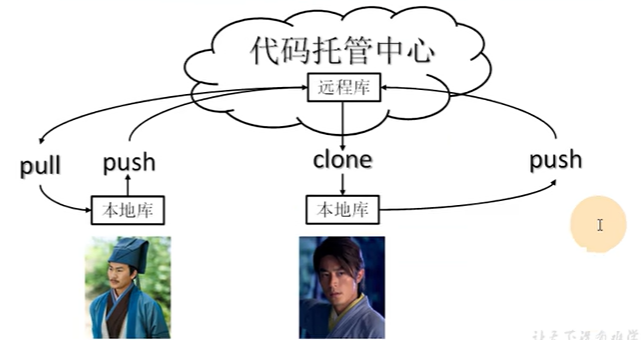
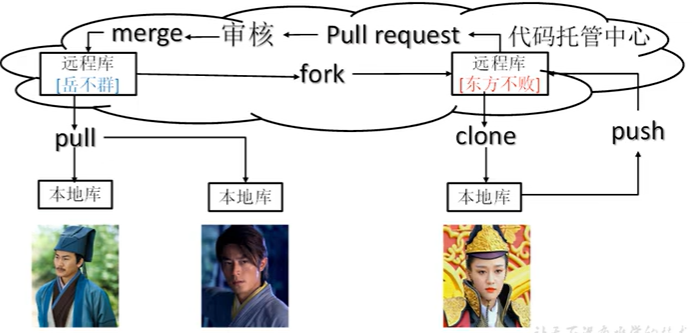

####1、版本控制
  >版本控制是一种记录文件内容变化，以便将来查阅特定版本修订情况的系统。
  >最重要的是可以记录文件修改历史记录，从而让用户能够查看历史版本，方便版本切换。
  > 个人开发过渡到团队协作

####2、版本控制工具
- 集中式
- 分布式

####3、工作机制
- 工作区   （写代码）
- 暂存区   （临时存储）
- 本地库   （历史版本）

####4、Git和代码托管中心
>代码托管中心是基于网络服务器的远程代码仓库。一般我们简单称为远程库。
- 局域网
  - GitLab
- 互联网
  - GitHub （外网）
  - Gitee码云 （国内网站）

####5、Git常用命令
| 命令名称               | 作用 |
|------------------------|------|
| git config --global user.name 用户名    | 设置用户签名     |
| git config --global user.email 邮箱   | 设置用户签名        |
| git init   | 初始化本地库        |
| git status   | 查看本地库状态        |
| git add 文件名   | 添加到暂存区        |
|git commit -m '日志信息' 文件名   | 提交到本地库        |
| git reflog  | 查看历史记录        |
| git log  | 查看详细历史记录        |
|git reset --hard 版本号| 版本穿梭     |
|git rm --cached 文件名| 删除暂存区文件     |

####6、Git分支操作 
| 命令名称| 作用        |
|---------|-----------|
| git branch 分支名  | 创建分支        |
| git branch -v  | 查看分支        |
| git checkout 分支名  | 切换分支        |
| git merge 分支名  | 把指定的分支合并到当前分支上      |
#####冲突产生的原因：
>合并分支时，两个分支在**同一个文件的同一个位置**有两套完全不同的修改。Git无法替我们决定使用哪一个。必须**人为决定**新代码内容
#####解决冲突
1. 编辑有冲突的文件，删除特殊符号，决定要使用的内容
   1. 特殊符号：`<<<<<<<HEAD`当前分支的代码`========`合并过来的代码`>>>>>>>>合并过来的分支名`
2. 添加到暂存区`git add 文件名`
3. 执行提交（注意：此时使用git commit命令时不能带文件名）

####7、Git团队协作机制
1. 团队内协作
   
2. 跨团队协作
   

####8、GitHub操作
1. 创建远程仓库
2. 远程仓库操作
   
| 命名名称 | 作用 |
| -------- | ---- |
|git remote -v | 查看当前所有远程地址别名|
|git remote add 别名 远程地址| 起别名|
|git push 别名 分支|推送本地分支上的内容到远程仓库|
|git clone 远程地址|将远程仓库的内容克隆到本地|
|git pull 远程库地址别名 远程分支名|将远程仓库对于分支最新内容拉下来后与当前本地分支直接合并|

clone会做如下操作：
1. 拉取代码
2. 初始化本地仓库
3. 创建别名