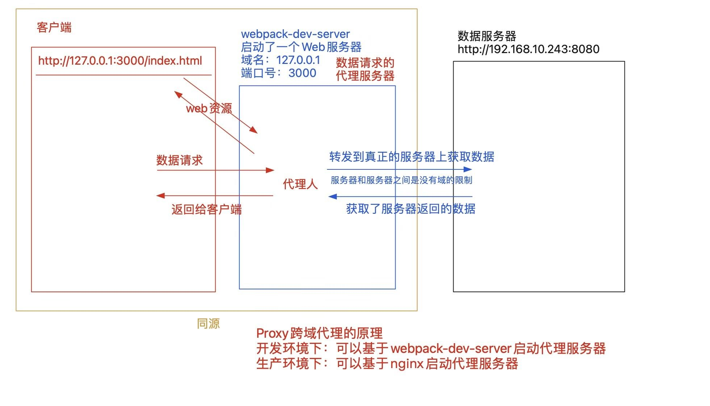

# Webpack5
>[webpack](https://webpack.docschina.org/)是一个现代JavaScript应用程序的静态模块打包工具。当webpack处理应用程序时，它会在内部构建一个依赖图(dependency [/dɪˈpendənsi/] graph [/ɡræf/])，此依赖图会映射项目所需的每个模块，并生成一个或多个bundle /ˈbʌndl/ 包！

#### 为啥要学webpack？

之前我们在讲前端性能优化的时候，我们可以从以下几个方面，去提高页面第一次渲染的速度，以及运行时的性能：

##### 第一类：明显改善页面第一次加载的速度，减少白屏等待的时间

1. 使用骨架屏技术
     + 服务器骨架屏：页面首屏内容是基于服务器渲染的
     + 前端骨架屏：在真实内容渲染出来之前，我们给予相关位置用“色框”占位！
2. 减少HTTP请求的次数和大小
     + CSS/JS都要做合并压缩「尽可能合并为一个CSS和一个JS」
     + 图片的合并压缩，例如：雪碧图(CSS Sprit)
     + 使用图片BASE64来加快图片的渲染！
     + 图片一定要做延迟加载
     + 使用字体图片和矢量图，来代替位图！！
     + 音视频资源也要设置延迟加载「preload='none'」
     + 数据的异步加载
     + 开启服务器端的GZIP压缩，可以让访问的资源压缩60%+
3. 渲染页面中的优化
     + 因为`<script>`会阻碍GUI渲染，所以：把其放在页面末尾，或者设置async/defer！
     + 因为`<link>`是异步加载CSS资源，所以建议放在页面开始，尽快获取样式资源！！
     + 不要使用import导入CSS，因为其会阻碍GUI的渲染！
     + 样式代码较少的情况下，使用`<style>`内嵌式，尤其是移动端开发！
4. 在网络传输中的优化
     + 减少cookie的内容大小「因为只要向服务器发送请求，不论服务器是否需要，总会在请求头中把cookie传递给服务器，如果cookie比较大，会让所有的请求都变慢」
     + 资源分服务器部署「例如：web服务器、图片服务器、数据服务器」，这样可以降低服务器压力，提高服务器的并发，让资源能更加合理的被利用；但是也会导致DNS解析次数增加，此时可以基于DNS Prefetch来优化DNS解析！！
     + 基于HTTP/2.0来代替HTTP/1.1
       + 基于新的二进制格式，让传输的内容更加丰富健壮
       + header压缩，让传输速度更快
       + 服务端推送，可以减少HTTP请求次数
       + 多路复用，让传输速度更快，避免线头阻塞
     + 基于Connection:keep-alive保持TCP通道长链接「HTTP/1.1版本会自动开启」
     + 开启CDN「地域分布式服务器部署」
     + 对于静态资源文件采取“强缓存和协商缓存”，对于不经常更新的数据请求，设置数据缓存！


##### 第二类：提高页面运行时候的性能

1. 减少循环嵌套，降低时间复杂度；避免出现死循环/死递归；
2. 使用事件委托来优化事件绑定，性能可以提高40%+
3. 减少DOM的回流(重排)和重绘
     + 样式分离读写「渲染队列机制」
     + 批量新增元素「字符串拼接、文档碎片」
     + 基于transform/opacity等方式操作样式
     + 把需要频繁修改样式的元素(例如：JS实现动画)脱离文档流
     + ...
4. 使用函数的防抖和节流处理高频触发操作
5. 合理使用闭包，避免内存泄漏，以及手动释放无用的内存！
6. 减少页面冗余代码，提高代码的重复使用率「也就是尽可能的做封装处理」
7. 尽可能不要使用for/in循环，因为其消耗性能
8. 避免使用eval/with等消耗性能的代码
9. 能用CSS3处理的动画坚决不用JS「JS动画尽可能基于requestAnimationFrame来代替定时器」
10. 避免使用CSS表达式，因为其非常消耗性能
11. CSS选择器的前缀不要过长「因为CSS选择器渲染是从右到左」
12. 减少table布局「table的渲染是比较消耗性能的」

我们平时开发的时候，一般会使用less/sass/stylus等CSS预编译器「需要基于vscode插件把其编译为CSS」；会直接使用ES6的语法「需要基于babel把其转换为ES5，以此兼容IE」；会给CSS3样式加很多的前缀，以此来处理兼容问题……
我们还会基于vscode中的liveserver插件，创建一个本地web服务器，来预览我们的项目…..
我们还要基于各种方案，来解决跨域访问的问题……

#### webpack可以帮我们干的事情

+ 代码转换：TypeScript编译成JavaScript、LESS/SCSS编译成CSS、ES6/7编译为ES5、虚拟DOM编译为真实的DOM等等…
+ 文件优化：压缩JS、CSS、HTML代码，压缩合并图片，图片BASE64等
+ 代码分割：提取多个页面的公共代码、提取首屏不需要执行部分的代码等
+ 模块合并：把模块分类合并成一个文件
+ 自动刷新：创建本地Web服务器，监听本地源代码的变化，自动重新构建，刷新浏览器
+ 代码校验：Eslint代码规范校验和检测、单元测试等
+ 自动发布：自动构建出线上发布代码并传输给发布系统
+ 跨域处理
+ ……

##### 除了webpack外，它们也可以做这些事情

+ grunt
+ gulp
+ Parcel
+ vite
+ rollup
+ Turbopack
+ ......

### 1. CommonJS规范 & ES6Module规范

未来的项目一定是 模块化/组件化 开发！！
模块化编程进化历史

+ 单例设计模式
+ AMD「require.js」
+ CommonJS
+ CMD「sea.js」
+ ES6Module

#### 单例设计模式
解决问题：模块间相互冲突的问题「闭包」 ; 模块间相互引用的问题;
不足之处：需要手动分析模块之间的依赖关系，按顺序依次导入相关模块；所有模块都是基于script一个个导入的，这样页面HTTP请求变多

```js
let xxxModule = (function () {
   let time = new Date();
   const query = function query() {
       // ...
   };
   const handle = function handle() {
       // ...
   };

   // 把供其它板块调用的方法，暴露到全局对象上
   //「局限：暴露的内容比较多，则还会引发全局变量冲突」
   // window.query = query;

   return {
       query,
       handle
   };
})();
```

#### [AMD「require.js」](https://requirejs.org) 
优势：在保证模块之间独立和可以相互访问的基础上，HTML中无需再导入各个模块了「不存在顺序问题」，也不需要自己去分析相互间的依赖关系！
不足：依赖模块的导入是“前置导入”，只有把依赖模块动态导入完毕，才会触发回调函数执行「阻碍代码执行速度」；代码书写的顺序也不是很方便；可能存在重复导入；
```js
//main.js
require.config({
    //全局配置
    baseUrl: 'js/lib',
});

require(['moduleB', 'moduleA'], function (moduleB, moduleA) {
    console.log(moduleB.average(10, 20, 30, 40, 50));
});

//moduleA.js
define(function () {
    return {
        sum(...args) {
            let len = args.length,
                firstItem = args[0];
            if (len === 0) return 0;
            if (len === 1) return firstItem;
            return args.reduce((total, item) => {
                return total + item;
            });
        }
    };
});

//moduleB.js
define(['moduleA'], function (moudleA) {
    return {
        // 求平均数（去掉最大最小值）
        average(...args) {
            let len = args.length,
                firstItem = args[0];
            if (len === 0) return 0;
            if (len === 1) return firstItem;
            args.sort((a, b) => a - b);
            args.pop();
            args.shift();
            return (moudleA.sum(...args) / args.length).toFixed(2);
        }
    };
});
```

#### CommonJS模块化规范
唯一的问题：浏览器端不支持CommonJS规范
淘宝“玉伯”仿照CommonJS规范，研发了一款插件 sea.js ，旨在把CommonJS规范搬到浏览器端运行「这种模块思想被称之为CMD」
```js
/* ---A.js--- */
const sum = function sum(...params) {
    return params.reduce((result, item) => {
        return result + item;
    });
};
// 暴露一些API
module.exports = {
    sum
};

/* ---B.js--- */
let name = '哈哈';
let A = require('./A');
const average = function average(...params) {
    return (A.sum(...params) / params.length).toFixed(2);
};
module.exports = {
    average
};

/* ---main.js--- */
let A = require('./A');
console.log(A.sum(10, 20, 30, 40));
let B = require('./B');
console.log(B.average(10, 20, 30, 40));
```

#### [ ES6Module模块规范](https://es6.ruanyifeng.com/#docs/module)
可以直接运行在浏览器端；不支持IE；
模块的导入导出:整体来讲，每个模块导出的是一个Module对象，我们可以基于 export/export default 为对象中加入导出的内容

1. export default xxx;
      + xxx可以是任意类型值
      + 给Module对象新增一个 “default” 属性，属性值就是导出的值
      + 在一个模块中，export default只允许出现一次
    2. export 创建值的表达式（声明变量 = 值）;
      let num = 10;
      export num; //这样写是错误的
      export let num = 10; //这样写是正确的
      ---
        let num = 10;
        export {
          num, //这样写是可以的
          x:100 //这样写是错误的
        };
      ---
      + export可以出现多次，导出多个内容
      + 声明的变量叫啥名字，最后给Module对象加入的是同名的属性名，属性值就是变量的值

我们会基于 import 方法导入模块「导入模块导出的内容」
1. import N from '模块地址(在浏览器端不能忽略.js后缀名)';
     + N获取的不是整个导出的Module对象，仅仅获取的是Module中default这一项的值
     + 不能在import期间，直接对N解构赋值，因为涉及解构赋值就会变为另外一种情况
2. import {x,y} from '模块地址';
     + 直接对导出的Module对象中(排除default属性)，导出的内容进行解构赋值
3. import * as M from '模块地址';
     + 先导入所有导出的内容，赋值给M变量

### 2.webpack的基础操作

#### webpack打包的原理：
webpack其实是一个平台，在平台中，我们会安装/融入/配置各种打包规则
  + mode：打包模式「开发环境development、生产环境production」
  + entry：入口「webpack就是从入口开始，根据CommonJS/ES6Module模块规范，分析出模块之间的依赖，从而按照相关的依赖关系，进行打包的」
  + output：出口
  + loader：加载器「一般都是用于实现代码编译的，但是想编译啥代码，我们需要安装对应的加载器，并且完成相关的规则配置 https://webpack.docschina.org/loaders/」
  + plugin：插件「处理的需求比较多了，例如：压缩、编译HTML、清空打包... https://webpack.docschina.org/plugins/」
  + resolve：解析器
  + optimization：优化项
  + devServer：配合webpack-dev-server，在本地启动Web服务，实现项目预览以及跨域处理...
  + ......


webpack是基于Node.js进行打包的！！把打包后的内容，最后都是交给浏览器去访问的！！
  + 想用webpack，电脑上需要安装Node
  + webpack中，支持CommonJS模块规范「我们写的配置规则，就是基于CommonJS规范处理的」
  + webpack中，支持ES6Module模块规范
  + 而且两种规范在webpack中可以混淆使用「webpack内部做了处理」

wepack支持零配置打包：不需要自己写任何的配置规则，直接使用内置的默认规则进行打包
  1. 安装webpack
    ```shell
    $ yarn add webpack webpack-cli -D
    //安装在本地的模块，不能直接使用命令，我们还需要配置
    //可执行脚本命令 => package.json「前提是 node_modules/.bin目录下，
    //需要有这样的命令文件，才说明安装在本地的模块可以使用命令」
    "scripts": {
       "start": "webpack"
    },
    执行脚本命令
    $ yarn start     -> $ webpack
    ```
  2. 默认去找 src/index.js，把其作为打包的入口，进行打包！！ 
     打包后的内容输出到 dist/main.js 中！！
  -----
  以上两步操作，直接基于 $ npx webpack 处理也是一样的！！！

#### 自定义打包规则
  + 基础配置
```
webpack.config.js
```
```js
// Node内置的路径处理模块
const path = require('path');

// 导出自定义配置项
module.exports = {
    // 环境模式「生产环境：production   开发环境：development」
    mode: 'production',
    // 打包入口「相对路径」
    entry: './src/index.js',
    // 打包出口
    output: {
        // 生成的文件名. [hash]创建随机哈希值
        filename: 'bundle.[hash].js',
        // 打包地址「绝对路径」
        path: path.resolve(__dirname, 'dist')
    }
};
```

  + HtmlWebpackPlugin 打包编译HTML的
    + 把打包后的JS/CSS自动导入到页面中
    + 对HTML进行压缩处理
    + ...

```shell
https://www.webpackjs.com/plugins/html-webpack-plugin/
$ yarn add html-webpack-plugin -D
```

```js
const HtmlWebpackPlugin = require('html-webpack-plugin');
module.exports = {
    ...
    plugins: [
        new HtmlWebpackPlugin({
            // 指定视图模板
            template: './public/index.html',
            // 编译后视图的名字
            filename: 'index.html',
            // 是否压缩
            minify: true
        })
    ]
}
```
##### 多入口、多出口
```js
const HtmlWebpackPlugin = require('html-webpack-plugin');
// HtmlWebpackPlugin需要配置多套
const htmlPlugins = ['index', 'login'].map(chunk => {
    return new HtmlWebpackPlugin({
        template: `./public/${chunk}.html`,
        filename: `${chunk}.html`,
        // 指定导入的JS
        chunks: [chunk],
        minify: true
    });
});
module.exports = {
    mode: 'production',
    // 配置多入口
    entry: {
        index: "./src/index.js",
        login: "./src/login.js",
    },
    // 出口采用相同的规则
    output: {
        filename: "[name].[hash].js",
        path: path.resolve(__dirname, "dist")
    },
    plugins: [
        ...htmlPlugins
    ]
};
```
  + webpack-dev-server
    项目开发的流程：本地开发「边开发、边看效果  开发环境」-> 提测「打包，部署到测试服务器」-> 重新打包，部署到服务器上「生产环境」
    + 基于Node在客户端本地启动一个Web服务，帮助开发者预览开发的作品
    + 第一步：项目打包「打包后的内容没有放在dist目录下，放在了虚拟内存中」
    + 第二步：启动web服务器「从虚拟内存中获取打包的内容，进行实时预览」
    + 第三步：热更新「当代码修改后，会实时进行打包编译，自动刷新浏览器，渲染最新的效果」 => vscode中的LiveServer插件也是做这个事情的
    + 启动的Web服务器，可以作为数据跨域请求的代理服务器，也就是可以实现Proxy跨域代理！！
    + ...



```shell
https://webpack.js.org/configuration/dev-server/
$ yarn add webpack-dev-server -D
```
```js
/* paclage.json */
"scripts": {
   "start": "webpack server",
   "build": "webpack"
}

/* webpack.config.js */
module.exports = {
    ... 
    devServer: {
        // 域名
        host: '127.0.0.1',
        // 断口号
        port: 3000,
        // GZIP压缩
        compress: true,
        // 自动打开浏览器
        open: true,
        // 热更新
        hot: true,
        // 跨域代理
        proxy: {
          /*
            跨域代理的处理"/xxx”前缀: 主要就是用来区分，以“什么前缀”发的请求，我们代理到哪一台服务器上 [一般设置为"/ap".target: 代理的真正服务器地址
            pathRewrite: 地址重写，主要用于把用来区分不同代理的前缀，从最后请求的真正地址中移除掉changeOrigin: 修改请求头中的origin源信息
            ws: 支持webscoket通信机制
          */
            "/jian": {
                target: "https://www.jianshu.com/asimov",
                changeOrigin: true,
                ws: true,
                pathRewrite: { "^/jian": "" }
            },
            "/zhi": {
                target: "https://news-at.zhihu.com/api/4",
                changeOrigin: true,
                ws: true,
                pathRewrite: { "^/zhi": "" }
            }
        }
    }
};
/* 
测试接口 
  简书：
  https://www.jianshu.com/asimov/subscriptions/recommended_collections
  知乎：
  https://news-at.zhihu.com/api/4/news/latest
*/
```
  + clean-webpack-plugin
```shell
$ yarn add clean-webpack-plugin -D
```
```js
const { CleanWebpackPlugin } = require('clean-webpack-plugin');
module.exports = {
    ...
    plugins: [
      // 清除之前的打包内容
        new CleanWebpackPlugin()
    ]
};
```
#### 处理样式的loader「加载器」
对于CSS，我们总共要处理的事情：
1. 把less编译为CSS
2. 给CSS3设置前缀
3. 处理特殊语法「@import/url」
4. 实现CSS的合并打包「内嵌式、外链式」
```shell
$ yarn add css-loader style-loader less less-loader autoprefixer postcss-loader -D
```
```js
module.exports = {
    ...
    /* 配置模块加载器LOADER，执行顺序：从右向左、从下向上 */
    module: {
        rules: [{
            test: /\.(css|less)$/, // 基于正则匹配哪些模块需要处理
            use: [
                "style-loader", // 把CSS插入到HEAD中
                "css-loader", // 编译解析@import/URL()这种语法
                "postcss-loader", // /配合autoprefixer&browserlist给CSS3属性设置前缀[兼容]
                "less-loader" // 把LESS编译为CSS
            ]
        }]
    }
};
```
postcss.config.js
```js
module.exports = {
    plugins: [
        require('autoprefixer')
    ]
};

// 或者在配置项中直接处理
{
    loader: "postcss-loader",
    options: {
        postcssOptions: {
            plugins: [
                require('autoprefixer')
            ]
        }
    }
},
```
package.json OR .browserslistrc
```json
// https://github.com/browserslist/browserslist
"browserslist": [
  "> 1%",
  "last 2 versions",
  "not dead"
]
```
##### mini-css-extract-plugin 抽离CSS样式 /ˈekstrækt/
```shell
https://www.npmjs.com/package/mini-css-extract-plugin
$ yarn add mini-css-extract-plugin -D
```
```js
const MiniCssExtractPlugin = require('mini-css-extract-plugin');
module.exports = {
    ...
    plugins: [
        ...
        new MiniCssExtractPlugin({
            // 设置编译后的文件名字
            filename: 'main.[hash].css'
        })
    ],
    ...
    module: {
        rules: [{
            test: /\.(css|less)$/,
            use: [
                // 使用插件中的LOADER代替STYLE方式
                MiniCssExtractPlugin.loader,
                ...
            ]
        }]
    }
};
```
##### 基于babel实现ES6的转换
```shell
$ yarn add babel babel-loader @babel/preset-env @babel/core -D

$ yarn add @babel/polyfill
```
```js
module.exports = {
    ...
    module: {
        rules: [{
            test: /\.js$/,
            use: ['babel-loader'],
            // 设置编译时忽略的文件和指定编译目录
            include: path.resolve(__dirname, 'src'),
            exclude: /node_modules/
        }]
    }
};
```
babel.config.js
```js
module.exports = {
    presets: [
        "@babel/preset-env"
    ]
};
```
index.js
```js
import '@babel/polyfill';
```
##### 设置优化项：压缩CSS/JS
```shell
$ yarn add css-minimizer-webpack-plugin terser-webpack-plugin -D
```
```js
const TerserPlugin = require('terser-webpack-plugin');
const CssMinimizerWebpackPlugin = require('css-minimizer-webpack-plugin');
module.exports = {
    optimization: {
        // 设置压缩方式
        minimizer: [
            new CssMinimizerWebpackPlugin(),
            new TerserPlugin()
        ]
    }
};
```
##### 设置解析器：配置别名
```js
module.exports = {
    resolve: {
        alias: {
            // @以后代表的就是src这个路径
            '@': path.resolve(__dirname, './src')
        }
    }
};
```

##### 图片的处理
```shell
$ yarn add file-loader url-loader -D
```
```js
module.exports = {
    ...
    module: {
        rules: [
        ...
        {
            test: /\.(png|jpe?g|gif)$/i,
            type: 'javascript/auto'，//webpack5需要的
            use: [{
                loader: 'url-loader',
                options: {
                    // 把指定大小内的图片BASE64 r<=200KB则需要BASE64.
                    limit: 200 * 1024,
                    esModule: false,
                    // 编译后，没有BASE64的图片，编译输出的路径和名称
                    name: 'images/[name].[hash].[ext]'
                }
            }]
        }]
    },
    // 设置打包的最大资源大小
    performance: {
        maxAssetSize: 100 * 1024 * 1024 * 1024,
        maxEntrypointSize: 100 * 1024 * 1024 * 1024
    }
};
```