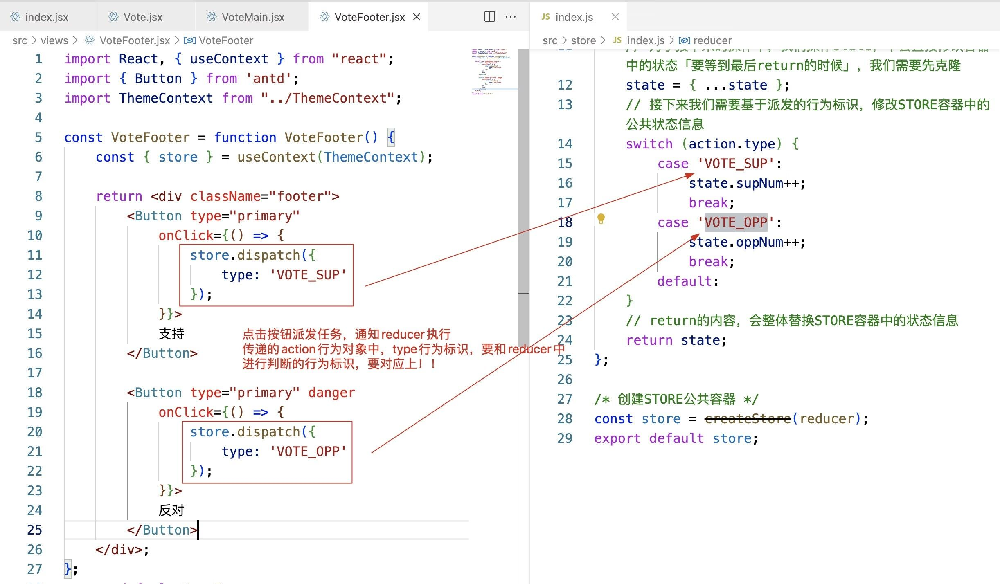

# React公共状态管理方案：redux & react-redux

前面的课程中，我们讲解了复合组件通信的两种方案：

+ 基于props属性实现父子组件通信(或具备相同父亲的兄弟组件)
+ 基于context上下文实现祖先和后代组件间的通信(或具备相同祖先的平行组件)

除了以上方案，其实还可以基于公共状态管理实现组件间的通信问题！


在Vue框架中，我们可以基于vuex实现公共状态管理！

## Redux 库和工具

Redux 是一个小型的独立 JS 库， 但是它通常与其他几个包一起使用：
`React-Redux`
React-Redux是我们的官方库，它让 React 组件与 Redux 有了交互，可以从 store 读取一些 state，可以通过 dispatch actions 来更新 store！
`Redux Toolkit`
Redux Toolkit 是我们推荐的编写 Redux 逻辑的方法。 它包含我们认为对于构建 Redux 应用程序必不可少的包和函数。 Redux Toolkit 构建在我们建议的最佳实践中，简化了大多数 Redux 任务，防止了常见错误，并使编写 Redux 应用程序变得更加容易。
`Redux DevTools 拓展`
Redux DevTools Extension 可以显示 Redux 存储中状态随时间变化的历史记录，这允许您有效地调试应用程序。

React生态圈中的知识：

+ redux  react-redux redux中间件
+ mobx「类的装饰器」
+ react-router-dom V5/V6
+ antd\antd mobile
+ fetch及其二次封装
+ redux-saga、dva、umi
+ antd pro
+ …

复合组件通信：

1. 父子通信「具备相同父亲的兄弟组件」：props属性 「基于ref」
2. 祖先和后代「具备相同祖先的平行组件」：context上下文
3. redux/react-redux  也是实现组件之间通信的技术「插件」
不管任何类型的组件，都可以基于这种方法，实现组件通信,公共状态管理方案
4. 后期实战开发中，父子组件一般是基于：props/ref/redux
其余组件的通信 一般都是基于redux管理的

## redux基础工作流程


除了redux这五步核心操作外，我们还需要一些其他的知识做配合！！

三个组件中，都需要用到创建的store容器

我在根组件中，导入store，把其放在上下文中，后期其他组件需要，只要是它的后代组件，则直接获取使用即可！！！


为了在各个组件中，都可以把创建的store获取到，我们可以基于上下文的方案：

1. 在index.jsx中，基于ThemeContext.Provider把创建的store放在上下文中
2. 因为所有组件最后都是在index.jsx中渲染，所有组件都可以理解为index.jsx的后代组件，基于上下文方案，获取在上下文中存储的store就可以了！！！





### 总结：

redux具体的代码编写顺序

1. 创建store，规划出reducer「当中的业务处理逻辑可以后续不断完善，但是最开始reducer的这个架子需要先搭建取来」
2. 在入口中，基于上下文对象，把store放入到上下文中；需要用到store的组件，从上下文中获取！！
3. 组件中基于store，完成公共状态的获取、和任务的派发
   + 使用到公共状态的组件，必须向store的事件池中加入让组件更新的办法；只有这样，才可以确保，公共状态改变，可以让组件更新，才可以获取最新的状态进行绑定！！

### Redux部分源码实现

```js
/* 实现redux部分源码 */
export const createStore = function createStore(reducer) {
  if (typeof reducer !== 'function') throw new Error('Expected the root reducer to be a function')

  let state, // 存放公共状态
    listeners = [] // 事件池

  /*获取公共状态 */
  const getState = function getState() {
    // 返回公共状态信息即可
    return state
  }

  /*向事件池中加入让组件更新的方法 */
  const subscribe = function subscribe(listener) {
    // 规则校验
    if (typeof listener !== 'function') throw new TypeError('Expected the listener to be a function')
    // 把传入的方法（让组件更新的办法）加入到事件池中【需要做去重处理】
    if (!listeners.includes(listener)) {
      listeners.push(listener)
    }
    // 返回一个从事件池中移出方法的函数
    return function unsubscribe() {
      let index = listeners.indexOf(listener)
      listeners.splice(index, 1)
    }
  }

  const isPlainObject = function isPlainObject(obj) {
    let proto, Ctor;
    if (!obj || toString.call(obj) !== "[object Object]") return false;
    proto = Object.getPrototypeOf(obj);
    if (!proto) return true;
    Ctor = {}.hasOwnProperty.call(proto, "constructor") && proto.constructor;
    return typeof Ctor === "function" && Ctor === Object;
  };

  /*派发任务通知reducer执行 */
  const dispatch = function dispatch(action) {
    //  规则校验
    if (!isPlainObject(action)) throw new TypeError('Actions must be plain objects')
    if (typeof action.type === 'undefined') throw new TypeError('Actions may not have an undefined "type" property')

    // 把reducer执行，传递：公共状态，行为对象；接收执行的返回值，替换公共状态
    state = reducer(state, action)

    // 当状态更改，我们还需要把事件池中的方法执行
    listeners.forEach(listener => {
      listener()
    })

    return action
  }

  /*redux内部会默认进行一次dispatch派发，目的：给公共容器中的状态赋值初始值 */
  const randomString = () => Math.random().toString(36).substring(7).split('').join('.')
  dispatch({
    // type:Symbol()
    type: '@@redux/INIT' + randomString()
  })

  // 返回创建的STORE对象
  return {
    getState,
    subscribe,
    dispatch
  }
} 
```

### redux工程化

在真正的项目中，我们一定会把状态和reducer的管理，按照模块化进行划分


第一件事情:按照模块，把reducer进行单独管理,每个模块都有自己的reducer;最后，我们还要把所有的reducer进行合并，合并为一个，赋值给我们创建的store!!

