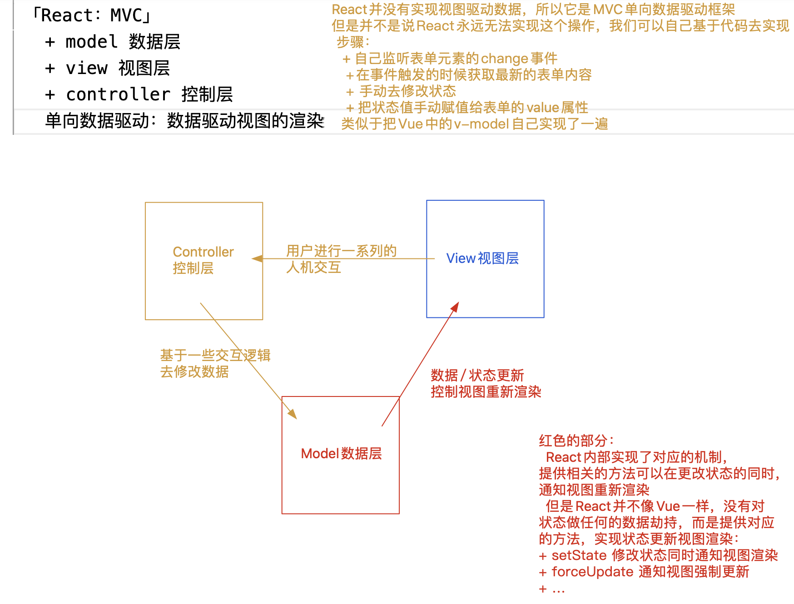
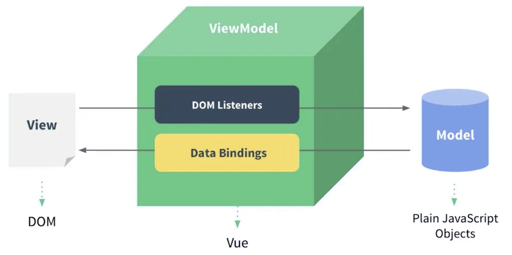

# 初始React

## 为什么要用react？

### 当前以及未来的前端开发，一定是：组件化/模块化

1. 有利于团队协作开发
2. 便于组件的复用：提高开发效率、方便后期维护、减少页面中的冗余代码
3. ...

#### 如何划分组件

##### 业务组件：针对项目需求封装的

1. 普通业务组件「没有啥复用性，只是单独拆出来的一个模块」
2. 通用业务组件「具备复用性」

##### 功能组件：适用于多个项目「例如：UI组件库中的组件」

1. 通用功能组件

##### 因为组件化开发，必然会带来“工程化”的处理

  也就是基于webpack等工具「vite/rollup/turbopack...」

+ 实现组件的合并、压缩、打包等
+ 代码编译、兼容、校验等
+ ...

---
## React是Web前端框架
1. 目前市面上比较主流的前端框架
    + React
    + Vue
    + Angular「NG」
    + ...
    主流的思想：不在直接去操作DOM，而是改为“数据驱动思想”
    操作DOM思想：
      + 操作DOM比较消耗性能「主要原因就是：可能会导致DOM重排(回流)/重绘」
      + 操作起来也相对来讲麻烦一些
      + ...
    数据驱动思想：
      + 我们不会在直接操作DOM
      + 我们去操作数据「当我们修改了数据，框架会按照相关的数据，让页面重新渲染」
      + 框架底层实现视图的渲染，也是基于操作DOM完成的
        + 构建了一套 虚拟DOM->真实DOM 的渲染体系
        + 有效避免了DOM的重排/重绘
      + 开发效率更高、最后的性能也相对较好

2. React框架采用的是MVC体系；Vue框架采用的是MVVM体系；
   + MVC：model数据层 + view视图层 + controller控制层
      1. 我们需要按照专业的语法去构建视图（页面）：React中是基于jsx语法来构建视图的
      2. 构建数据层：但凡在视图中，需要“动态”处理的(需要变化的，不论是样式还是内容)，我们都要有对应的数据模型
      3. 控制层：当我们在视图中(或者根据业务需求)进行某些操作的时候，都是去修改相关的数据，然后React框架会按照最新的数据，重新渲染视图，以此让用户看到最新的效果！
      数据驱动视图的渲染！！
      视图中的表单内容改变，想要修改数据，需要开发者自己去写代码实现！！
      “单向驱动”
      
  + MVVM：model数据层 + view视图层 + viewModel数据/视图监听层
      1. 数据驱动视图的渲染：监听数据的更新，让视图重新渲染
      2. 视图驱动数据的更改：监听页面中表单元素内容改变，自动去修改相关的数据
      “双向驱动”
      

---------------

## React的工程化/组件化开发

我们可以基于webpack自己去搭建一套工程化打包的架子，但是这样非常的麻烦/复杂；React官方，为我们提供了一个脚手架：create-react-app！！

+ 脚手架：基于它创建项目，默认就把webpack的打包规则已经处理好了，把一些项目需要的基本文件也都创建好了！！

### create-react-app基础运用

1. 安装脚手架 
```shell
$ npm i create-react-app -g  「mac前面要设置sudo」
    检查安装情况 
$ create-react-app --version
```
2. 基于脚手架创建React工程化的项目
```shell
$ create-react-app 项目名称
    + 项目名称要遵循npm包命名规范：使用“数字、小写字母、_”命名
  项目目录
    |- node_modules：包含安装的模块
    |- src：所以后续编写的代码，几乎都放在SRC下「打包的时候，一般只对这个目录下的代码进行处理」
        |- index.js：程序入口「jsx后缀名可以让文件支持jsx语法」
    |- public：放页面模板和IconLogo
        |- index.html
    |- package.json
    |- ...
```
package.json
```json
{
  ...
  "dependencies": {
    ...
    "react": "^18.2.0",  //核心
    "react-dom": "^18.2.0",  //视图编译
    "react-scripts": "5.0.1", //对打包命令的集成
    "web-vitals": "^2.1.4"  //性能检测工具
  },
  "scripts": {
    "start": "react-scripts start", //开发环境启动web服务进行预览
    "build": "react-scripts build", //生产环境打包部署
    "test": "react-scripts test",   //单元测试
    "eject": "react-scripts eject"  //暴露配置项
  },
  "eslintConfig": {  //ESLint词法检测
    "extends": [
      "react-app",
      "react-app/jest"
    ]
  },
  "browserslist": {  //浏览器兼容列表
    "production": [
      ">0.2%",
      "not dead",
      "not op_mini all"
    ],
    "development": [
      "last 1 chrome version",
      "last 1 firefox version",
      "last 1 safari version"
    ]
  }
}
```
### 一个React项目中，默认会安装：
+ react：React框架的核心
+ react-dom：React视图渲染的核心「基于React构建WebApp（HTML页面）」
  + react-native：构建和渲染App的
+ react-scripts：脚手架为了让项目目录看起来干净一些，把webpack打包的规则及相关的插件/LOADER等都隐藏到了node_modules目录下，react-scripts就是脚手架中自己对打包命令的一种封装，基于它打包，会调用node_modules中的webpack等进行处理！！

默认情况下，会把webpack配置项隐藏到node_modules中，如果想修改，则需要暴露配置项：
`$ yarn eject`
```json
/* package.json中的变化 */
{
  "dependencies":{  //暴露后，webpack中需要的模块都会列在这
     ...
  },
  "scripts": {
    "start": "node scripts/start.js",  
    "build": "node scripts/build.js",
    "test": "node scripts/test.js"
    //不在基于react-scripts处理命令，而是直接基于node去执行对应的文件
    //已经没有eject命令了
  },
  "jest": {
    //单元测试配置
  },
  "babel": {  //关于babel-loader的额外配置
    "presets": [
      "react-app"
    ]
  }
}

/* 新增的内容 */
|- scripts
    |- start.js
    |- build.js
    |- ...
|- config
    |- webpack.config.js
    |- paths.js
    |- ...
```

#### 真实项目中常用的一些修改操作
`配置less`
默认安装和配置的是sass，如果需要使用less，则需要：
1. 安装
  ```shell
  $ yarn add less less-loader@8
  $ yarn remove sass-loader
  ```
2. 修改webpack.config.js
```js
// 72~73
const lessRegex = /\.less$/;
const lessModuleRegex = /\.module\.less$/;

//507~545
{
  test: lessRegex,
  exclude: lessModuleRegex,
  use: getStyleLoaders(
    ...
    'less-loader'
  )
},
{
  test: lessModuleRegex,
  use: getStyleLoaders(
    ...
    'less-loader'
  ),
}
```
`配置别名`
```js
//313
resolve: {
  ...
  alias: {
    '@': path.appSrc,
    ...
  }
}
```
`配置预览域名`
scripts/start.js
```js
// 48
const HOST = process.env.HOST || '127.0.0.1';
// 也可以基于 cross-env 设置环境变量
```
`配置跨域代理`
安装 http-proxy-middleware
```shell
$ yarn add http-proxy-middleware
```
src/setupProxy.js
```js
const { createProxyMiddleware } = require('http-proxy-middleware');
module.exports = function (app) {
    app.use(
        createProxyMiddleware("/api", {
            target: "http://127.0.0.1:7100",
            changeOrigin: true,
            ws: true,
            pathRewrite: { "^/api": "" }
        })
    );
};

//测试地址：
//https://www.jianshu.com/asimov/subscriptions/recommended_collections
//https://news-at.zhihu.com/api/4/news/latest
```
`配置浏览器兼容`

package.json
```json
//https://github.com/browserslist/browserslist
"browserslist": {
  "production": [
    ">0.2%",
    "not dead",
    "not op_mini all"
  ],
  "development": [
    "last 1 chrome version",
    "last 1 firefox version",
    "last 1 safari version"
  ]
}
```
```js
/*
CSS兼容处理：设置前缀
autoprefixer + postcss-loader + browserslist

JS兼容处理：ES6语法转换为ES5语法
babel-loader + babel-preset-react-app(@babel/preset-env) + browserslist
babel-preset-react-app
对原有 @babel/preset-env的重写目的:让其支持JSX语法的编译


JS兼容处理：内置API
入口配置react-app-polyfill
*/
import 'react-app-polyfill/ie9';
import 'react-app-polyfill/ie11';
import 'react-app-polyfill/stable';
```
其余的一些优化配置、响应式布局的配置等，实战中再去处理！！

---
## JSX构建视图的基础知识
> JSX：javascript and xml(html) 把JS和HTML标签混合在了一起「并不是我们之前玩的字符串拼接」
1. vscode如何支持JSX语法「格式化、快捷提示...」
    + 创建的js文件，我们把后缀名设置为jsx即可，这样js文件中就可以支持JSX语法了
    + webpack打包的规则中，也是会对.jsx这种文件，按照JS的方式进行处理的
2. 在HTML中嵌入“JS表达式”，需要基于“{} 胡子语法”
    + JS表达式：执行有结果的
3. 在ReactDOM.createRoot()的时候，不能直接把HTML/BODY做为根容器，需要指定一个额外的盒子「例如：#root」
4. 每一个构建的视图，只能有一个“根节点”
    + 出现多个根节点则报错 Adjacent JSX elements must be wrapped in an enclosing tag.
    + React给我们提供了一个特殊的节点(标签)：React.Fragment 空文档标记标签
      <></>
      既保证了可以只有一个根节点，又不新增一个HTML层级结构！！
5. {}胡子语法中嵌入不同的值，所呈现出来的特点
    + number/string：值是啥，就渲染出来啥
    + boolean/null/undefined/Symbol/BigInt：渲染的内容是空
    + 除数组对象外，其余对象一般都不支持在{}中进行渲染，但是也有特殊情况:
      + JSX虚拟DOM对象
      + 给元素设置style行内样式，要求必须写成一个对象格式
    + 数组对象：把数组的每一项都分别拿出来渲染「并不是变为字符串渲染，中间没有逗号」
    + 函数对象：不支持在{}中渲染，但是可以作为函数组件，用`<Component/>`方式渲染!!
    + ...
6. 给元素设置样式
    + 行内样式：需要基于对象的格式处理，直接写样式字符串会报错
      ```jsx
      <h2 style={{
        color: 'red',
        fontSize: '18px' //样式属性要基于驼峰命名法处理
      }}>
      ```
    + 设置样式类名：需要把class替换为className
      ```jsx
      <h2 className="box">
      ```
JSX语法具备过滤效果（过滤非法内容），有效防止XSS攻击（扩展思考：总结常见的XSS攻击和预防方案？）

---
import React from 'react'; //React语法核心
import ReactDOM from 'react-dom/client'; //构建HTML(WebApp)的核心

//获取页面中#root的容器，作为“根”容器
const root = ReactDOM.createRoot(document.getElementById('root'));

//基于render方法渲染我们编写的视图，把渲染后的内容，全部插入到#root中进行渲染
root.render(
    ....
);

### 驼峰命名法
  + 小驼峰  camelCase   首字母小写，其余每一个有意义单词首字母大写
  + 大驼峰  PascalCase  首字母都要大写
#### kabab-case 写法：personal-box

#### 稀疏数组和密集数组
1. 稀疏数组：只传一个数字N，是创建长度为 N，每一项是empty的稀疏数组
```js
new Array(5)
```
基于数组的fill方法，把稀疏数组进行填充变为我们的密集数组
```js
let arr2=arr1.fill(null) 
```
2. 密集数组：密集数组：每一项都有值，哪怕值是null