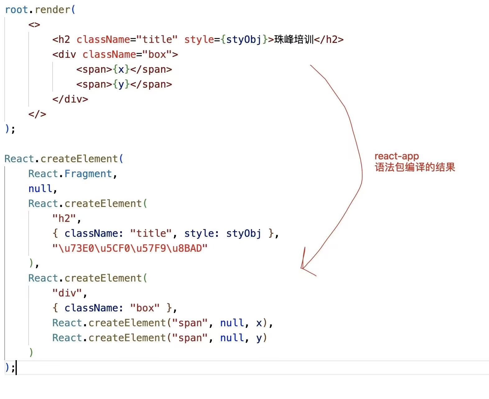
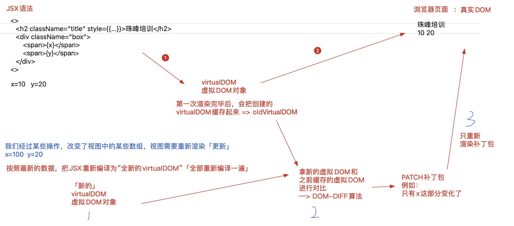

# JSX底层原理

## 1.关于JSX底层处理机制
### 第一步：把我们编写的JSX语法，编译为虚拟DOM对象「virtualDOM」
> 虚拟DOM对象：框架自己内部构建的一套对象体系（对象的相关成员都是React内部规定的），基于这些属性描述出，我们所构建视图中的，DOM节点的相关特征！！
1. 基于 babel-preset-react-app 把JSX编译为 React.createElement(...) 这种格式！！
只要是元素节点，必然会基于createElement进行处理！
React.createElement(ele,props,...children)
   + ele：元素标签名「或组件」
   + props：元素的属性集合(对象)「如果没有设置过任何的属性，则此值是null」
   + children：第三个及以后的参数，都是当前元素的子节点

1. 再把 createElement 方法执行，创建出virtualDOM虚拟DOM对象「也有称之为：JSX元素、JSX对象、ReactChild对象...」！！
    virtualDOM = {
      $$typeof: Symbol(react.element),
      ref: null,
      key: null,
      type: 标签名「或组件」,
      // 存储了元素的相关属性 && 子节点信息
      props: {
          元素的相关属性,
          children:子节点信息「没有子节点则没有这个属性、属性值可能是一个值、也可能是一个数组」
      }
    }
    

### 第二步：把构建的virtualDOM渲染为真实DOM

> 真实DOM：浏览器页面中，最后渲染出来，让用户看见的DOM元素！！

基于ReactDOM中的render方法处理的！！
  v16
  ReactDOM.render(
    <>...</>,
    document.getElementById('root')
  );

  v18
  const root = ReactDOM.createRoot(document.getElementById('root'));
  root.render(
    <>...</>
  );

  补充说明：第一次渲染页面是直接从virtualDOM->真实DOM；但是后期视图更新的时候，需要经过一个DOM-DIFF的对比，计算出补丁包PATCH（两次视图差异的部分），把PATCH补丁包进行渲染！！


### JSX底层渲染机制

#### createElement
```js
/* createElement:创建虚拟DOM对象 */
export function createElement(ele, props, ...children) {
    let virtualDOM = {
        $$typeof: Symbol('react.element'),
        key: null,
        ref: null,
        type: null,
        props: {}
    };
    let len = children.length;
    virtualDOM.type = ele;
    if (props !== null) {
        virtualDOM.props = {
            ...props
        };
    }
    if (len === 1) virtualDOM.props.children = children[0];
    if (len > 1) virtualDOM.props.children = children;
    return virtualDOM;
};
```
```js
/* 
封装一个对象迭代的方法 
  + 基于传统的for/in循环，会存在一些弊端「性能较差(既可以迭代私有的，也可以迭代公有的)；只能迭代“可枚举、非Symbol类型的”属性...」
  + 解决思路：获取对象所有的私有属性「私有的、不论是否可枚举、不论类型」
    + Object.getOwnPropertyNames(arr) -> 获取对象非Symbol类型的私有属性「无关是否可枚举」
    + Object.getOwnPropertySymbols(arr) -> 获取Symbol类型的私有属性
    获取所有的私有属性：
      let keys = Object.getOwnPropertyNames(arr).concat(Object.getOwnPropertySymbols(arr));
    可以基于ES6中的Reflect.ownKeys代替上述操作「弊端：不兼容IE」
      let keys = Reflect.ownKeys(arr);
*/
const each = function each(obj, callback) {
    if (obj === null || typeof obj !== "object") throw new TypeError('obj is not a object');
    if (typeof callback !== "function") throw new TypeError('callback is not a function');
    let keys = Reflect.ownKeys(obj);
    keys.forEach(key => {
        let value = obj[key];
        // 每一次迭代，都把回调函数执行
        callback(value, key);
    });
};
```
#### render
```js
/* render:把虚拟DOM变为真实DOM */
export function render(virtualDOM, container) {
    let { type, props } = virtualDOM;
    if (typeof type === "string") {
        // 存储的是标签名:动态创建这样一个标签
        let ele = document.createElement(type);
        // 为标签设置相关的属性 & 子节点
        each(props, (value, key) => {
            // className的处理：value存储的是样式类名
            if (key === 'className') {
                ele.className = value;
                return;
            }
            // style的处理：value存储的是样式对象
            if (key === 'style') {
                each(value, (val, attr) => {
                    ele.style[attr] = val;
                });
                return;
            }
            // 子节点的处理：value存储的children属性值
            if (key === 'children') {
                let children = value;
                if (!Array.isArray(children)) children = [children];
                children.forEach(child => {
                    // 子节点是文本节点：直接插入即可
                    if (/^(string|number)$/.test(typeof child)) {
                        ele.appendChild(document.createTextNode(child));
                        return;
                    }
                    // 子节点又是一个virtualDOM：递归处理
                    render(child, ele);
                });
                return;
            }
            ele.setAttribute(key, value);
        });
        // 把新增的标签，增加到指定容器中
        container.appendChild(ele);
    }
};
```