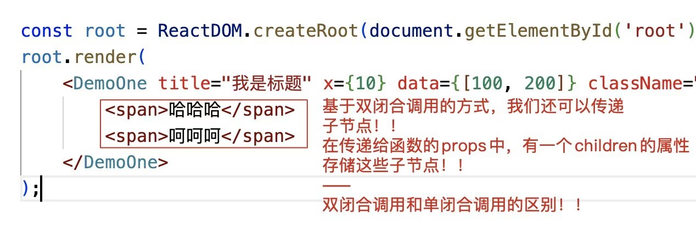
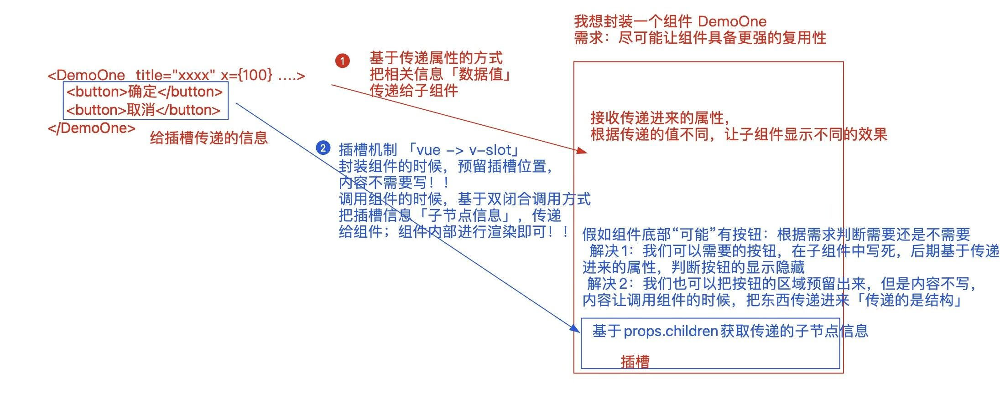
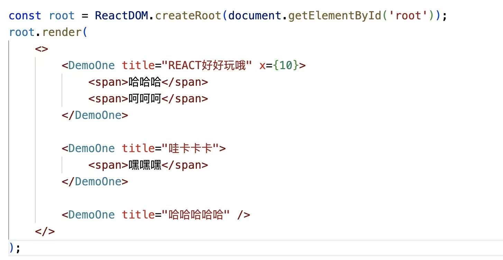
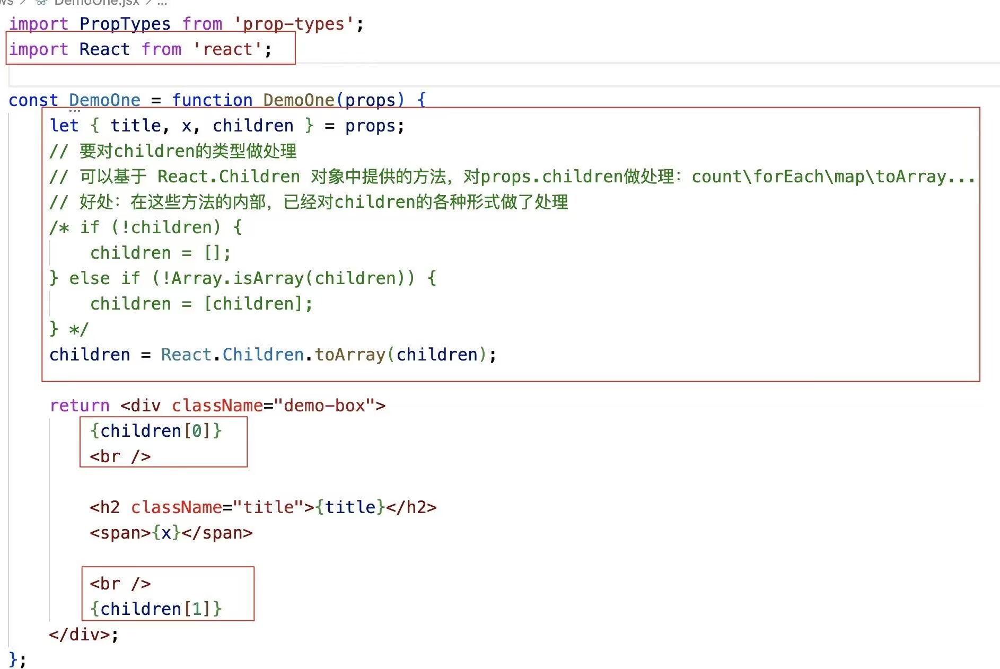
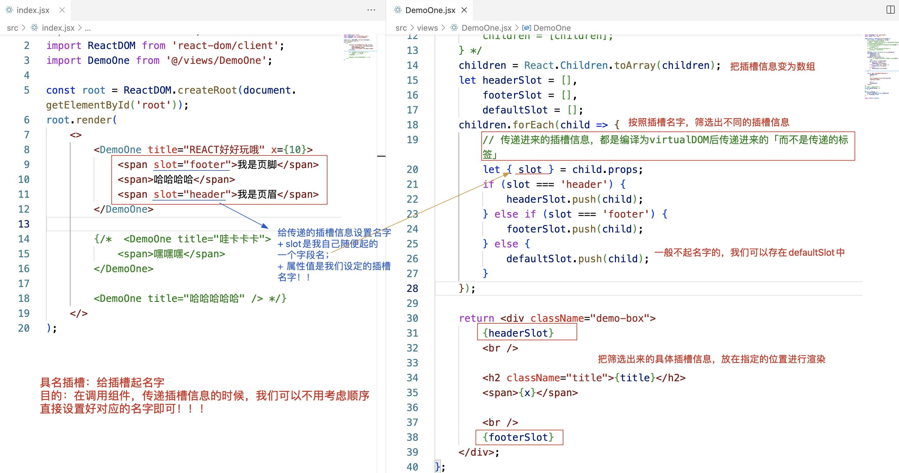
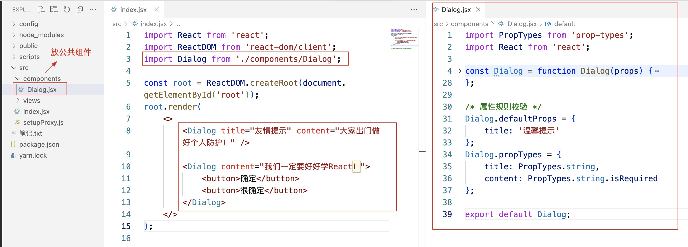
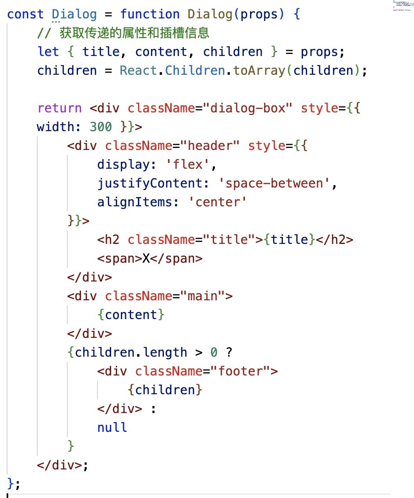

# React组件化开发

##### 组件化开发的优势
+ 利于团队协作开发
+ 利于组件复用
+ 利于SPA单页面应用开发
+ ……

Vue中的组件化开发：
http://fivedodo.com/upload/html/vuejs3/guide/migration/functional-components.html

1. 全局组件和局部组件
2. 函数组件（functional）和类组件「Vue3不具备functional函数组件」

#### React中的组件化开发：
> 没有明确全局和局部的概念「可以理解为都是局部组件，不过可以把组件注册到React上，这样每个组件中只要导入React即可使用」
1. 函数组件
2. 类组件
3. Hooks组件：在函数组件中使用React Hooks函数


## 函数组件

创建：在SRC目录中，创建一个 xxx.jsx 的文件，就是要创建一个组件；我们在此文件中，创建一个函数，让函数返回JSX视图「或者JSX元素、virtualDOM虚拟DOM对象」；这就是创建了一个“函数组件”！！
调用：基于ES6Module规范，导入创建的组件「可以忽略.jsx后缀名」，然后像写标签一样调用这个组件即可！！
    `<Component/>` 单闭合调用
    `<Component> ... </Component>` 双闭合调用
命名：组件的名字，我们一般都采用PascalCase「大驼峰命名法」这种方式命名


调用组件的时候，我们可以给调用的组件设置(传递)各种各样的属性

```js
<DemoOne title="我是标题" x={10} data={[100, 200]} className="box" style={{ fontSize: '20px' }} />
```
+ 如果设置的属性值不是字符串格式，需要基于“{}胡子语法”进行嵌套
+ 调用组件的时候，我们可以把一些数据/信息基于属性props的方式，传递给组件！！


--------
#### 渲染机制
1. 基于babel-preset-react-app把调用的组件转换为createElement格式
```js
React.createElement(DemoOne, {
  title: "\u6211\u662F\u6807\u9898",
  x: 10,
  data: [100, 200],
  className: "box",
  style: {
      fontSize: '20px'
  }
})
```
2. 把createElement方法执行，创建出一个virtualDOM对象！！
```js
{
  $$typeof: Symbol(react.element),
  key: null,
  props: {title: '我是标题', x: 10, data: 数组, className: 'box', style: {fontSize: '20px'}}, //如果有子节点「双闭合调用」，则也包含children！！
  ref: null,
  type: DemoOne
}
```
3. 基于root.render把virtualDOM变为真实的DOM
  + type值不再是一个字符串，而是一个函数了，此时：
      + 把函数执行 -> DemoOne()
      + 把virtualDOM中的props，作为实参传递给函数 -> DemoOne(props)
      + 接收函数执行的返回结果「也就是当前组件的virtualDOM对象」
      + 最后基于render把组件返回的虚拟DOM变为真实DOM，插入到#root容器中！！
 

#### 属性props的处理
  + 调用组件，传递进来的属性是“只读”的「原理：props对象被冻结了」
    Object.isFrozen(props) -> true
    获取：props.xxx
    修改：props.xxx=xxx  =>报错
  + 作用：父组件(index.jsx)调用子组件(DemoOne.jsx)的时候，可以基于属性，把不同的信息传递给子组件；子组件接收相应的属性值，呈现出不同的效果，让组件的复用性更强！！
  + 虽然对于传递进来的属性，我们不能直接修改，但是可以做一些规则校验
    + 设置默认值
      函数组件.defaultProps = {
        x: 0,
        ......
      };
    + 设置其它规则，例如：数据值格式、是否必传... 「依赖于官方的一个插件：prop-types」
      https://github.com/facebook/prop-types
      import PropTypes from 'prop-types';
      函数组件.propTypes = {
        // 类型是字符串、必传
        title: PropTypes.string.isRequired,
        // 类型是数字
        x: PropTypes.number,
        // 多种校验规则中的一个
        y: PropTypes.oneOfType([
            PropTypes.number,
            PropTypes.bool,
        ])
      };
    传递进来的属性，首先会经历规则的校验，不管校验成功还是失败，最后都会把属性给形参props，只不过如果不符合设定的规则，控制台会抛出警告错误{不影响属性值的获取}！！
  + 如果就想把传递的属性值进行修改，我们可以：
    + 把props中的某个属性赋值给其他内容「例如：变量、状态...」
    + 我们不直接操作props.xxx=xxx，但是我们可以修改变量/状态值！！
```js
// views/FunctionComponent.jsx
import React from "react";
import PropTypes from 'prop-types';
const FunctionComponent = function FunctionComponent(props) {
    /* 被冻结:不能修改/新增/删除/劫持...「可以赋值给其它状态再进行修改」 */
    // console.log(Object.isFrozen(props)); //->true

    /* 对props.children进行操作：count/forEach/map/toArray... */
    // console.log(React.Children);

    return <div>
        我是函数组件
    </div>;
};
// 赋值属性默认值
FunctionComponent.defaultProps = {
    x: 0,
    title: '',
    arr: [],
    num: 0
};
// 设置属性规则
FunctionComponent.propTypes = {
    x: PropTypes.number,
    title: PropTypes.string.isRequired,
    arr: PropTypes.array,
    num: PropTypes.any
};
export default FunctionComponent;
```

### 插槽
和属性一样，都是想办法，让组件具备更强的复用性
+ 传递数据值用属性
+ 传递HTML结构，用插槽

#### 实现插槽


#### 实现具名插槽

#### 封装Dialog组件



#### 函数组件是“静态组件”
第一次渲染组件，把函数执行
  + 产生一个私有的上下文：EC(V)
  + 把解析出来的props「含children」传递进来「但是被冻结了」
  + 对函数返回的JSX元素「virtualDOM」进行渲染


当我们点击按钮的时候，会把绑定的小函数执行：
  + 修改上级上下文EC(V)中的变量
  + 私有变量值发生了改变
  + 但是“视图不会更新”
=>也就是，函数组件第一次渲染完毕后，组件中的内容，不会根据组件内的某些操作，再进行更新，所以称它为静态组件
    + 函数组件是静态组件
    + 不具备状态、生命周期函数、ref等内容
    + 第一次渲染完毕，除非父组件控制其重新渲染，否则内容不会再更新
    + 优势：渲染速度快
    + 弊端：静态组件，无法实现组件动态更新
=>除非在父组件中，重新调用这个函数组件「可以传递不同的属性信息」

真实项目中，有这样的需求：第一次渲染就不会再变化的，可以使用函数组件！！
但是大部分需求，都需要在第一次渲染完毕后，基于组件内部的某些操作，让组件可以更新，以此呈现出不同的效果！！==> 动态组件「方法：类组件、Hooks组件(在函数组件中，使用Hooks函数)」
 