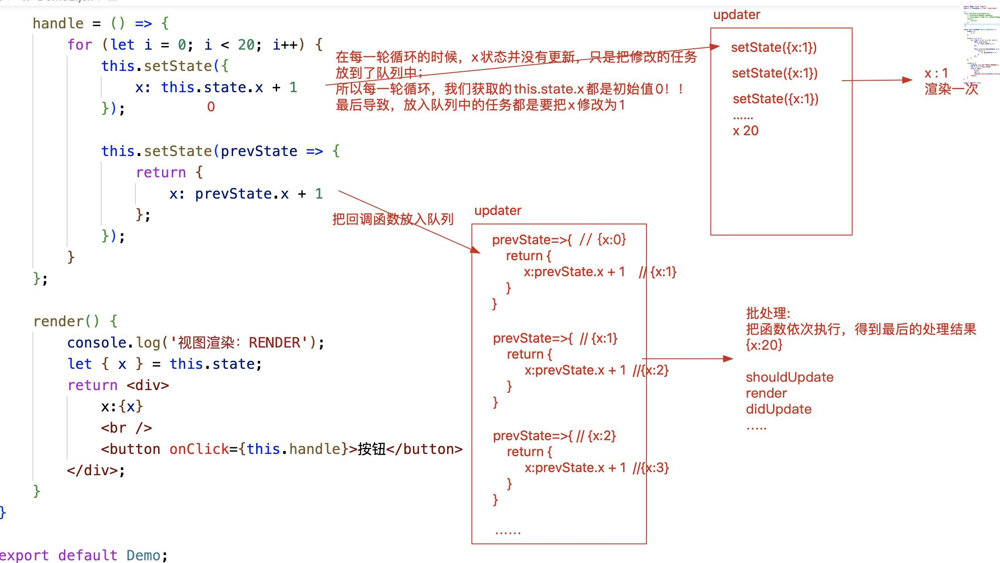

# 类组件

## 创建类组件

### 创建一个构造函数(类)

+ 要求必须继承React.Component/PureComponent这个类
+ 我们习惯于使用ES6中的class创建类「因为方便」
+ 必须给当前类设置一个render的方法「放在其原型上」：在render方法中，返回需要渲染的视图

### 从调用类组件「new Vote({...})」开始，类组件内部发生的事情：

1. 初始化属性 && 规则校验
先规则校验，校验完毕后，再处理属性的其他操作！！
   + 方案一：
   ```js
    constructor(props) {
      super(props); //会把传递进来的属性挂载到this实例上
      console.log(this.props); //获取到传递的属性
    }
   ```

   + 方案二：即便我们自己不再constructor中处理「或者constructor都没写」，在constructor处理完毕后，React内部也会把传递的props挂载到实例上；所以在其他的函数中，只要保证this是实例，就可以基于this.props获取传递的属性！
   + 同样this.props获取的属性对象也是被冻结的{只读的}  Object.isFrozen(this.props)->true
1. 初始化状态
  状态：后期修改状态，可以触发视图的更新
  需要手动初始化，如果我们没有去做相关的处理，则默认会往实例上挂载一个state，初始值是null => this.state=null
  手动处理：
  state = {
    ...
  };
  ---------修改状态，控制视图更新
  this.state.xxx=xxx ：这种操作仅仅是修改了状态值，但是无法让视图更新
  想让视图更新，我们需要基于React.Component.prototype提供的方法操作：
    + this.setState(partialState) 既可以修改状态，也可以让视图更新 「推荐」
      + partialState:部分状态
      this.setState({
        xxx:xxx
      });
    + this.forceUpdate() 强制更新
1. 触发 componentWillMount 周期函数(钩子函数)：组件第一次渲染之前
      钩子函数：在程序运行到某个阶段，我们可以基于提供一个处理函数，让开发者在这个阶段做一些自定义的事情
      + 此周期函数，目前是不安全的「虽然可以用，但是未来可能要被移除了，所以不建议使用」
        + 控制会抛出黄色警告「为了不抛出警告，我们可以暂时用 UNSAFE_componentWillMount」
      + 如果开启了React.StrictMode「React的严格模式」，则我们使用 UNSAFE_componentWillMount 这样的周期函数，控制台会直接抛出红色警告错误！！
        React.StrictMode VS "use strict"
        + "use strict"：JS的严格模式
        + React.StrictMode：React的严格模式，它会去检查React中一些不规范的语法、或者是一些不建议使用的API等！！

2. 触发 render 周期函数：渲染
3. 触发 componentDidMount 周期函数：第一次渲染完毕
      + 已经把virtualDOM变为真实DOM了「所以我们可以获取真实DOM了」
      + ...

### 组件更新的逻辑「当修改了相关状态，组件会更新」

1. 触发 shouldComponentUpdate 周期函数：是否允许更新

```js
shouldComponentUpdate(nextProps, nextState) {
 // nextState:存储要修改的最新状态
 // this.state:存储的还是修改前的状态「此时状态还没有改变」
 console.log(this.state, nextState);

 // 此周期函数需要返回true/false
 //   返回true：允许更新，会继续执行下一个操作
 //   返回false：不允许更新，接下来啥都不处理
 return true;
}
```

2. 触发 componentWillUpdate 周期函数：更新之前
   + 此周期函数也是不安全的
   + 在这个阶段，状态还没有被修改
3. 修改状态值/属性值「让this.state.xxx改为最新的值」
4. 触发 render 周期函数：组件更新
   + 按照最新的状态/属性，把返回的JSX编译为virtualDOM
   + 和上一次渲染出来的virtualDOM进行对比「DOM-DIFF」
   + 把差异的部分进行渲染「渲染为真实的DOM」
5. 触发 componentDidUpdate 周期函数：组件更新完毕
特殊说明：如果我们是基于 this.forceUpdate() 强制更新视图，会跳过 shouldComponentUpdate 周期函数的校验，直接从 WillUpdate 开始进行更新「也就是：视图一定会触发更新」！

### 组件更新的逻辑「第二种：父组件更新，触发的子组件更新」
1. 触发 componentWillReceiveProps 周期函数：接收最新属性之前
+ 周期函数是不安全的
UNSAFE_componentWillReceiveProps(nextProps) {
  // this.props:存储之前的属性
  // nextProps:传递进来的最新属性值
  console.log('componentWillReceiveProps:', this.props, nextProps);
}
1. 触发 shouldComponentUpdate 周期函数
......

### 组件卸载的逻辑

 1. 触发 componentWillUnmount 周期函数：组件销毁之前
 2. 销毁

### 父子组件嵌套，处理机制上遵循深度优先原则：父组件在操作中，遇到子组件，一定是把子组件处理完，父组件才能继续处理

+ 父组件第一次渲染
父 willMount -> 父 render「子 willMount -> 子 render -> 子didMount」 -> 父didMount 
+ 父组件更新：
父 shouldUpdate -> 父willUpdate -> 父 render 「子willReceiveProps -> 子 shouldUpdate -> 子willUpdate -> 子 render -> 子 didUpdate」-> 父 didUpdate
+ 父组件销毁：
父 willUnmount -> 处理中「子willUnmount -> 子销毁」-> 父销毁


### 函数组件是“静态组件”：

+ 组件第一次渲染完毕后，无法基于“内部的某些操作”让组件更新「无法实现“自更新”」；但是，如果调用它的父组件更新了，那么相关的子组件也一定会更新「可能传递最新的属性值进来」；
+ 函数组件具备：属性...「其他状态等内容几乎没有」
+ 优势：比类组件处理的机制简单，这样导致函数组件渲染速度更快！！
类组件是“动态组件”：
+ 组件在第一渲染完毕后，除了父组件更新可以触发其更新外，我们还可以通过：this.setState修改状态 或者 this.forceUpdate 等方式，让组件实现“自更新”！！
+ 类组件具备：属性、状态、周期函数、ref...「几乎组件应该有的东西它都具备」
+ 优势：功能强大！！

===>Hooks组件「推荐」：具备了函数组件和类组件的各自优势，在函数组件的基础上，基于hooks函数，让函数组件也可以拥有状态、周期函数等，让函数组件也可以实现自更新「动态化」！！

### PureComponent和Component的区别：

PureComponent会给类组件默认加一个shouldComponentUpdate周期函数

+ 在此周期函数中，它对新老的属性/状态 会做一个钱浅比较
+ 如果经过浅比较，发现属性和状态并没有改变，则返回false「也就是不继续更新组建」；有变化才会去更新！！


```js
// 检测是否为对象
const isObject = function isObject(obj) {
    return obj !== null && /^(object|function)$/.test(typeof obj);
};
// 对象浅比较的方法
const shallowEqual = function shallowEqual(objA, objB) {
    if (!isObject(objA) || !isObject(objB)) return false;
    if (objA === objB) return true;
    // 先比较成员的数量
    let keysA = Reflect.ownKeys(objA),
        keysB = Reflect.ownKeys(objB);
    if (keysA.length !== keysB.length) return false;
    // 数量一致，再逐一比较内部的成员「只比较第一级：浅比较」
    for (let i = 0; i < keysA.length; i++) {
        let key = keysA[i];
        // 如果一个对象中有这个成员，一个对象中没有；或者，都有这个成员，但是成员值不一样；都应该被判定为不相同！！
        if (!objB.hasOwnProperty(key) || !Object.is(objA[key], objB[key])) {
            return false;
        }
    }
    // 以上都处理完，发现没有不相同的成员，则认为两个对象是相等的
    return true;
};
```


```js
class Demo extends React.PureComponent {
    state = {
        arr: [10, 20, 30] //0x001
    };

    render() {
        let { arr } = this.state; //arr->0x001
        return <div>
            {arr.map((item, index) => {
                return <span key={index} style={{
                    display: 'inline-block',
                    width: 100,
                    height: 100,
                    background: 'pink',
                    marginRight: 10
                }}>
                    {item}
                </span>;
            })}

            <br />

            <button onClick={() => {
                arr.push(40); //给0x001堆中新增一个40

                /* 
                // 无法更新的
                console.log(this.state.arr); //[10,20,30,40]
                this.setState({ arr }); //最新修改的转态地址，还是0x001「状态地址没有改」 
                */

                // this.forceUpdate(); //跳过默认加的shouldComponentUpdate，直接更新
                this.setState({
                    arr: [...arr] //我们是让arr状态值改为一个新的数组「堆地址」
                })
            }}>新增SPAN</button>
        </div >;
    }

    /* shouldComponentUpdate(nextProps, nextState) {
        let { props, state } = this;
        // props/state：修改之前的属性状态
        // nextProps/nextState：将要修改的属性状态
        return !shallowEqual(props, nextProps) || !shallowEqual(state, nextState);
    } */
}
```

### 受控组件：基于修改数据/状态，让视图更新，达到需要的效果 「推荐」
### 非受控组件：基于ref获取DOM元素，我们操作DOM元素，来实现需求和效果「偶尔」
#### 基于ref获取DOM元素的语法
1. 给需要获取的元素设置ref='xxx'，后期基于this.refs.xxx去获取相应的DOM元素「不推荐使用：在React.StrictMode模式下会报错」
   ```js
   <h2 ref="titleBox">...</h2>
   ```
   获取：this.refs.titleBox

2. 把ref属性值设置为一个函数
   ref={x=>this.xxx=x}
     + x是函数的形参：存储的就是当前DOM元素
     + 然后我们获取的DOM元素“x”直接挂在到实例的某个属性上(例如：box2)
   获取：this.xxx

3. 基于React.createRef()方法创建一个REF对象
   this.xxx=React.createRef();  //=> this.xxx={current:null}
   ref={REF对象(this.xxx)}
   获取：this.xxx.current

原理：在render渲染的时候，会获取virtualDOM的ref属性
  + 如果属性值是一个字符串，则会给this.refs增加这样的一个成员，成员值就是当前的DOM元素
  + 如果属性值是一个函数，则会把函数执行，把当前DOM元素传递给这个函数「x->DOM元素」,而在函数执行的内部，我们一般都会把DOM元素直接挂在到实例的某个属性上
  + 如果属性值是一个REF对象，则会把DOM元素赋值给对象的current属性

#### 给元素标签设置ref，目的：获取对应的DOM元素 
给类组件设置ref，目的：获取当前调用组件创建的实例「后续可以根据实例获取子组件中的相关信息」
给函数组件设置ref，直接报错：Function components cannot be given refs. Attempts to access this ref will fail.
  + 但是我们让其配合 React.forwardRef 实现ref的转发
  + 目的：获取函数子组件内部的某个元素


### setState原理
`this.setState([partialState],[callback])`
+ `[partialState]`:支持部分状态更改
  ```js
  this.setState({
    x:100 //不论总共有多少状态，我们只修改了x，其余的状态不动
  });
  ```
+ `[callback]`:在状态更改/视图更新完毕后触发执行「也可以说只要执行了setState，callback一定会执行」
    + 发生在componentDidUpdate周期函数之后「DidUpdate会在任何状态更改后都触发执行；而回调函数方式，可以在指定状态更新后处理一些事情；」
    + 特殊：即便我们基于shouldComponentUpdate阻止了状态/视图的更新，DidUpdate周期函数肯定不会执行了，但是我们设置的这个callback回调函数依然会被触发执行！！
    + 类似于Vue框架中的$nextTick！！
+ 在React18 和 React16中，关于setState是同步还是异步，是有一些区别的！
    + React18中：不论在什么地方执行setState，它都是异步的「都是基于updater更新队列机制，实现的批处理」
    + React16中：如果在合成事件「jsx元素中基于onXxx绑定的事件」、周期函数中，setState的操作是异步的！！但是如果setState出现在其他异步操作中「例如：定时器、手动获取DOM元素做的事件绑定等」，它将变为同步的操作「立即更新状态和让视图渲染」！！


```js
this.setState((prevState)=>{
  // prevState:存储之前的状态值
  // return的对象，就是我们想要修改的新状态值「支持修改部分状态」
  return {
      xxx:xxx
  };
})
```

