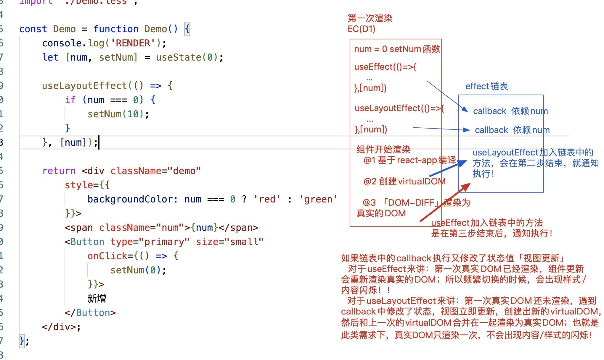

# React Hooks 组件化开发

## React组件分类

### 函数组件

+ 不具备“状态、ref、周期函数”等内容，第一次渲染完毕后，无法基于组件内部的操作来控制其更新，因此称之为静态组件！
+ 但是具备属性及插槽，父组件可以控制其重新渲染！
+ 渲染流程简单，渲染速度较快！
+ 基于FP（函数式编程）思想设计，提供更细粒度的逻辑组织和复用！

### 类组件

+ 具备“状态、ref、周期函数、属性、插槽”等内容，可以灵活的控制组件更新，基于钩子函数也可灵活掌控不同阶段处理不同的事情！
+ 渲染流程繁琐，渲染速度相对较慢！
+ 基于OOP（面向对象编程）思想设计，更方便实现继承等！

### React Hooks 组件

+ 就是基于 React 中新提供的 Hook 函数，可以让`函数组件动态化`!

## Hook函数概览

Hook 是 React 16.8 的新增特性！并且只能运用到函数组件中！
[hooks地址](https://zh-hans.reactjs.org/docs/hooks-reference.html)

### 基础 Hook

+ useState 使用状态管理
+ useEffect 使用周期函数
+ useContext 使用上下文信息

### 额外的 Hook

+ useReducer useState的替代方案，借鉴redux处理思想，管理更复杂的状态和逻辑
+ useCallback 构建缓存优化方案
+ useMemo 构建缓存优化方案
+ useRef 使用ref获取DOM
+ useImperativeHandle 配合forwardRef（ref转发）一起使用
+ useLayoutEffect 与useEffect相同，但会在所有的DOM变更之后同步调用effect
+ …

### 自定义Hook

+ ……

## useState

> React Hook函数之一，目的是在函数组件中使用状态，并且后期基于状态的修改，可以让组件更新

### 语法

let [num,setNum] = useState(initialValue);

+ 执行useState，传递的initialValue是初始的状态值
+ 执行这个方法，返回结果是一个数组:[状态值，修改状态的方法]
  + num变量存储的是: 获取的状态值
  + setNum变量存储的是: 修改状态的方法
+ 执行 setNum(value)
  + 修改状态值为value
  + 通知视图更新 


函数组件「或者Hooks组件」不是类组件，所以没有实例的概念「调用组件不再是创建类的实例，而是把函数执行，产生一个私有上下文而已」，再所以，在函数组件中不涉及this的处理! !

函数组件的每一次渲染(或者是更新)，都是把函数(重新)执行，产生一个全新的“私有上下文"!

+ 内部的代码也需要重新执行
+ 涉及的函数需要重新的构建{这些函数的作用域(函数执行的上级上下文)，是每一次执行DENO产生的闭包}+每一次执行DEMO函数，也会把useState重新执行，但是:
  + 执行useState，只有第一次，设置的初始值会生效，其余以后再执行，获取的状态都是最新的状态值「而不是初始值」
  + 返回的修改状态的方法，每一次都是返回一个新的


##### useState实现原理

```js
var _state;
function usestate( initialvalue) {
  if (typeof _state === "undefined" ) _state = initialValue;
  var setState = function setState(value) {
    _state = value;
    //通知视图更新
  }
  return [_state,setState];
}
let [num1,setNum] = usestate(0); //num1=0setNum=setState 0x001
setNum( 100); //=>_state=100通知视图更新
let [num2，setNum] = useState(0); //num2=100setNum=setState 0x002
```


##### 执行一次useState:把需要的状态信息都放在对象中统一管理

+ 执行setState方法的时候，传递的是啥值，就把状态"整体"改为啥值

```js
setstate({
  supNum: state.supNum + 1
})
```
=>把状态值修改为{supNum: 11} , oppNum成员就丢失了
=>并不会像类组件中的this.setState一样，不支持部分状态的更新

+ 应该改为以下的处理方案
```js
setState({
  ...state, //在修改值之前，先把原有的所有状态，都展开赋值给新对象，再去修改要改动的那一项值即可
  supNum: state.supNum + 1
});
```

+ 官方建议是:需要多个状态，就把usestate执行多次即可
#### 更新队列机制
和类组件中的setState一样，每次更新状态值，也不是立即更新，而是加入到更新队列中！

+ React 18 全部采用批更新

+ 可以基于flushSync刷新渲染队列

+ React 16 部分批更新，也和this.setState一样，放在合成事件/周期函数中，其是异步的操作；但是放在其它的异步操作中「例如：定时器、手动的事件绑定等」它是同步的


#### useState自带了性能优化的机制:

+ 每一次修改状态值的时候，会拿最新要修改的值和之前的状态值做比较「基于Object.is作比较」
+ 如果发现两次的值是一样的，则不会修改状态，也不会让视图更新「可以理解为:类似于PureComponeht，在shouldComponentlpdate中做了比较和优化l


#### 惰性初始state

如果初始 state 需要通过复杂计算获得，则可以传入一个函数，在函数中计算并返回初始的 state，此函数只在初始渲染时被调用！


#### 惰性初始state使用


## useEffect

> useEffect:在函数组件中,使用生命周期函数
+ useEffect(callback)：没设置依赖
  + 第一次渲染完毕后，执行callback，等价于componentDidMount
  + 在组件每一次更新完毕后，也会执行callback，等价于componentDidUpdate
+ useEffect(callback, [])：设置了，但是无依赖
  + 只有第一次渲染完毕后，才会执行callback，每一次视图更新完毕后，callback不再执行
  + 类似于componentDidMount
+ useEffect(callback,[依赖的状态(多个状态)])：
  + 第一次洹染完毕会执行callback
  + 当依赖的状态值(或者多个依赖状态中的一个)发生改变，也会触发callback执行
  + 但是依赖的状态如果没有变化，在组件更新的时候,callback是不会执行的

```js
useEffect(()=>{
  return ()=>{
    // 返回的小函数，会在组件释放的时候执行
    // 如果组件更新，会把上一次返回的小函数执行「可以“理解为”上一次渲染的组件释放了」
  };
});
```

### useEffect原理

函数组件在渲染（或更新）期间，遇到useEffect操作，会基于MountEffect方法把callback（和依赖项）加入到effect链表中！

在视图渲染完毕后，基于UpdateEffect方法，通知链表中的方法执行！

1. 按照顺序执行期间，首先会检测依赖项的值是否有更新「有容器专门记录上一次依赖项的值」；有更新则把对应的callback执行，没有则继续处理下一项！！
2. 遇到依赖项是空数组的，则只在第一次渲染完毕时，执行相应的callback
3. 遇到没有设置依赖项的，则每一次渲染完毕时都执行相应的callback


### 异步获取数据

不能直接对[callback]设置async，因为它只能返回一个函数（或者不设置返回值）
useEffect必须在函数的最外层上下文中调用，不能把其嵌入到条件判断、循环等操作语句中
```js
import React, { useState, useEffect } from "react";
const queryData = () => {
    return fetch('/api/subscriptions/recommended_collections')
        .then(response => {
            return response.json();
        });
};
export default function Demo() {
    let [data, setData] = useState([]);
    /* // Warning: useEffect must not return anything besides a function, which is used for clean-up.
    useEffect(async () => {
        let result = await queryData();
        setData(result);
        console.log(result);
    }, []); */
    useEffect(() => {
        const next = async () => {
            let result = await queryData();
            setData(result);
            console.log(result);
        };
        next();
    }, []);
    return <div>
        ...
    </div>;
};
```

## useLayoutEffect

其函数签名与 useEffect 相同，但它会在所有的 DOM 变更之后同步调用 effect。
可以使用它来读取 DOM 布局并同步触发重渲染。
在浏览器执行绘制之前，useLayoutEffect 内部的更新计划将被同步刷新。
尽可能使用标准的 useEffect 以避免阻塞视觉更新。
```js
import React, { useState, useEffect, useLayoutEffect } from "react";
export default function Demo() {
  let [num, setNum] = useState(0);
  // 再试试useLayoutEffect
  useEffect(() => {
      if (num === 0) {
          let random = +String(Math.random()).substring(2);
          setNum(random);
      }
  }, [num]);
  return <div
      style={{
          background: 'lightblue',
          WebkitUserSelect: "none"
      }}
      onClick={() => {
          setNum(0);
      }}>
      {num}
  </div>;
};
```

### useLayoutEffect与useEffect区别




useLayoutEffect会阻塞浏览器渲染真实DOM，优先执行Effect链表中的callback;
useEffect不会阻塞浏览器渲染真实DOM，在渲染真实DOM的同时，去执行Effect链表中的callback;
+ useLayoutEffect设置的callback要优先于useEffect去执行!!
+ 在两者设置的callback中，依然可以获取DOM元素「原因∶真实DOW对象已经创建了，区别只是浏览器是否渲染」
+ 如果在callback函数中又修改了状态值「视图又要更新」
  + useEffect:浏览器肯定是把第一次的真实已经绘制了，再去渲染第二次真实DOM
  + useLayoutEffect:浏览器是把两次真实DOM的渲染，合并在一起渲染的

视图更新的步骤︰
第一步︰基于babel-preset-react-app把JSX编译为createElement格式
第二步:把createElement执行，创建出virtualDoM
第三步∶基于root.render方法把virtualDOM变为真实DOM对象「DOM-DIFF

  + useLayoutEffect阻塞第四步操作，先去执行Effect链表中的方法「同步操作」+ useEffect第四步操作和Effect链表中的方法执行，是同时进行的「异步操作」

第四步:浏览器渲染和绘制真实DOM对象


## useRef

##### 类组件中，我们基于ref可以做的事情：

1. 赋值给一个标签：获取DOM元素
2. 赋值给一个类子组件：获取子组件实例「可以基于实例调用子组件中的属性和方法等」
3. 赋值给一个函数子组件：报错「需要配合React.forwardRef实现ref转发，获取子组件中的摸一个DOM元素」

##### ref的使用方法：

1. ref='box'
   this.refs.box 获取 {不推荐使用}
2. ref={x=>this.box=x}
   this.box 获取
3. this.box=React.createRef() 创建一个ref对象
  ```js
  <h2 ref={this.box}>
  ```
   this.box.current 获取DOM元素

##### 函数组件

1. 基于“ref={函数}”"的方式，可以把创建的DOM元素(或者子组件的实例)赋值给box变量「不推荐」
2. 也可基于React.createRef创建ref对象来获取想要的内容
3. 函数组件中，还可以基于useRef Hook函数，创建一个ref对象
   + React.createRef也是创建ref对象，即可在类组件中使用，也可以在函数组件中使用
   + useRef 只能在函数组件中用「所有的ReactHook函数，都只能在函数组件中时候用，在类组件中使用会报错」

```js
import React, { useState, useEffect, useRef, createRef } from "react";
let prev;
export default function Demo() {
  const [num, setNum] = useState(0);
  const btnBox = useRef(null); //换成createRef也是可以的
  if (!prev) {
      prev = btnBox;
  } else {
      console.log(prev === btnBox);
  }
  useEffect(() => {
      console.log(btnBox.current);
  }, []);
  return <div>
      <span>{num}</span>
      <button ref={btnBox} onClick={() => setNum(num + 1)}>按钮</button>
  </div>;
};
```

+ useRef再每一次组件更新的时候（函数重新执行)，再次执行useRef方法的时候，不会创建新的REF对象了，获取到的还是第一次创建的那个REF对象! !I
+ createRef在每一次组件更新的时候，都会创建一个全新的REF对象出来，比较浪费性能!!
+ 总结︰在类组件中，创建REF对象，我们基于React.createRef处理;但是在函数组件中，为了保证性能，我们应该使用专属的useRef处理!!

类组件：基于ref获取子组件的实例，这样基于实例，可以调用子组件内部，挂载到实例上的东西

函数组件：基于forwardRef实现ref转发，目的:获取子组件内部的某个元素


## useImperativeHandle

useImperativeHandle 可以让你在使用 ref 时自定义暴露给父组件的实例值，应当与 forwardRef 一起使用，实现ref转发！基于forwardRef实现ref转发的同时，获取函数子组件内部的状态或者方法

```js
import React, { useEffect, useRef, useImperativeHandle, forwardRef } from "react";
const Child = forwardRef(function (props, ref) {
  useImperativeHandle(ref, () => {
      return {
          submit: () => {
              console.log('调用了子组件的submit方法！');
          }
      };
  });
  return <div>
      ...
  </div>;
});
export default function Demo() {
  const box = useRef(null);
  useEffect(() => {
      console.log(box.current);
      box.current.submit();
  }, []);
  return <div>
      <Child ref={box} />
  </div>;
};
```


函数组件中，遇到：修改某个状态后（视图更新后），想去做一些事情（而这些事情中，需要用到新修改的状态值）
此时：我们不能直接在代码的下面编写，或者把修改状态改为同步的，这些都不可以！因为只有在函数重新执行，产生的新的闭包中，才可以获取最新的状态值！！原始闭包中用的还是之前的状态值！！
———> 基于useEffect设置状态的依赖，在依赖的状态发生改变后，去做要做的事情！！

==========
修改某个状态后（视图更新后），想去做一些事情，但是要处理的事情，和新的状态值没有关系，此时可以把修改状态的操作，基于flushSync变为同步处理即可！！


## useMemo

函数组件执行影响


在前端开发的过程中，我们需要缓存一些内容，以避免在需渲染过程中因大量不必要的耗时计算而导致的性能问题。为此 React 提供了一些方法可以帮助我们去实现数据的缓存，useMemo 就是其中之一！

#### 语法

```js
let xX×= useMemo( callback, [dependencies])
```

+ 第一次渲染组件的时候，callback会执行
+ 后期只有依赖的状态值发生改变，callback才会再执行
+ 每—次会把callback执行的返回结果赋值给x××
+ useMemo具备“计算缓存"，在依赖的状态值没有发生改变, callback没有触发执行的时候，xxx获取的是上一次计算出来的结果
和Vue中的计算属性非常的类似!!

###### useMemo就是一个优化的Hook函数

+ 如果函数组件中，有消耗性能/时间的计算操作，则尽可能用useMemo缓存起来,设置对应的依赖;
+ 这样可以保证，当非依赖的状态发生改变，不会去处理一些没必要的操作，提高组件更新的速度!!


## useCallback

>简单来讲: useCallback可以保证，函数组件的每一次更新，不再把里面的小函数重新创建，用的都是第一次创建的!!

函数组件的每一次更新,都是把函数重新执行

+ 产生一个新的闭包
+ 在闭包中所有创建函数的操作，都会:重新创建新的堆内存「也就是函数都会重新创建」

#### 语法

```js
const ·xxX·=·usecallback(callback, [dependencies] )
```

+ 组件第一次渲染,useCallback执行，创建一个函数"“callback"，赋值给xx×
+ 组件后续每一次更新，判断依赖的状态值是否改变，如果改变，则重新创建新的函数堆，赋值给xxX，但是如果，依赖的状态没有更新「或者没有设置依赖“[]"」则xxx获取的一直是第一次创建的函数堆，不会创建新的函数出来! !
+ 或者说，基于useCallback，可以始终获取第一次创建函数的堆内存地址(或者说函数的引用)

useCallback不要乱用！并不是所有组件内部的函数，都拿其处理会更好！！

+ 虽然减少了堆内存的开辟
+ 但是useCallback本身也有自己的处理逻辑和缓存的机制，这个也消耗时间啊

啥时候用它呢？

+ 父组件嵌套子组件，父组件要把一个内部的函数，基于属性传递给子组件，此时传递的这个方法，我们基于useCallback处理一下会更好！！

诉求:当父组件更新的时候，因为传递给子组件的属性仅仅是一个函数「特点∶基本应该算是不变的」，所以不想再让子组件也跟着更新了!

+ 第一条∶传递给子组件的属性（函数)，每一次需要是相同的堆内存地址(是一致的)，基于useCallback处理! !
+ 第二条∶在子组件内部也要做一个处理，验证父组件传递的属性是否发生改变，如果没有变化，则让子组件不能更新，有变化才需要更新﹒继承React.PureComponent即可「在shouldcomponentUpdate中对新老属性做了浅比较」!!函数组件是基于React.memo 函数，对新老传递的属性做比较，如果不一致，才会把函数组件执行，如果一致，则不让子组件更新!!
