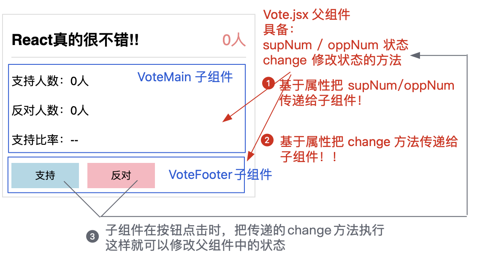
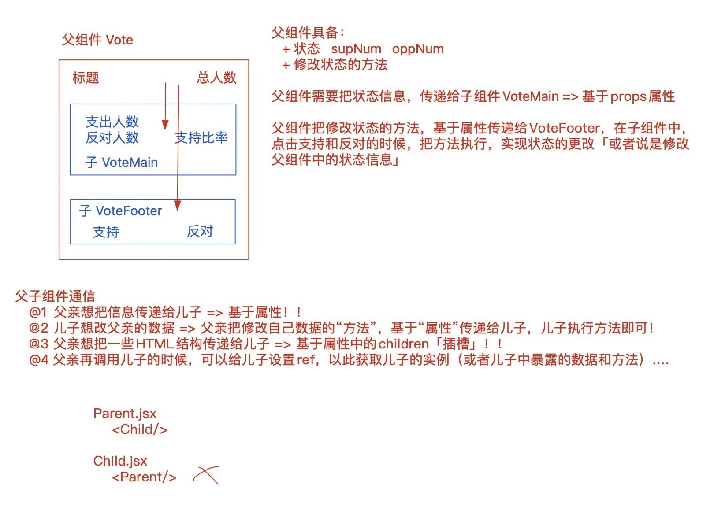
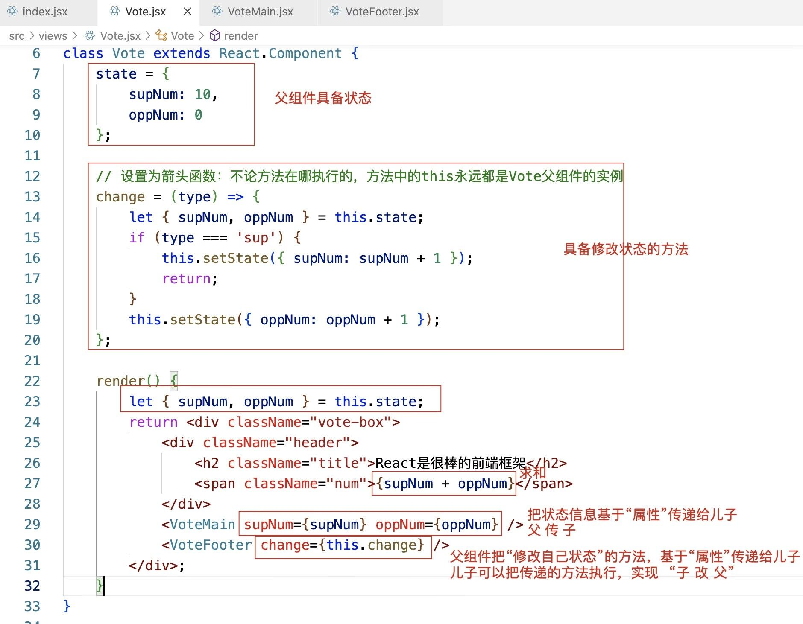
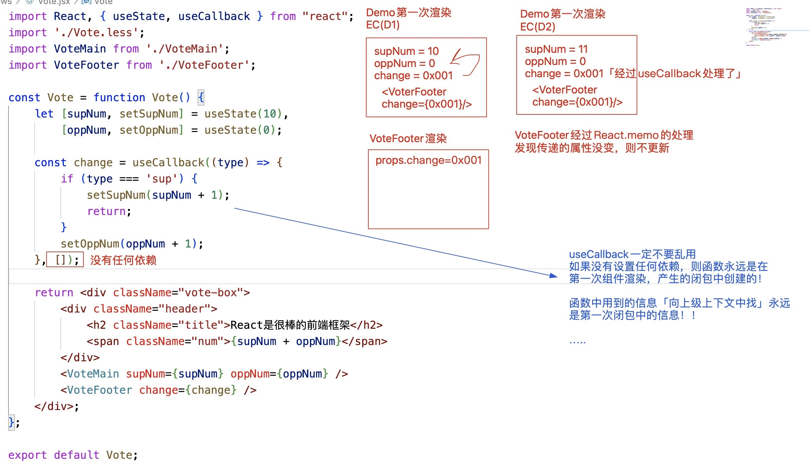
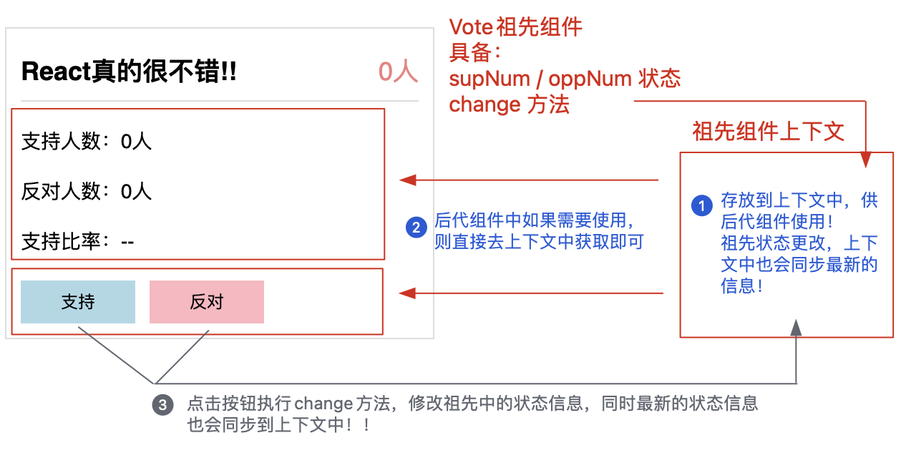
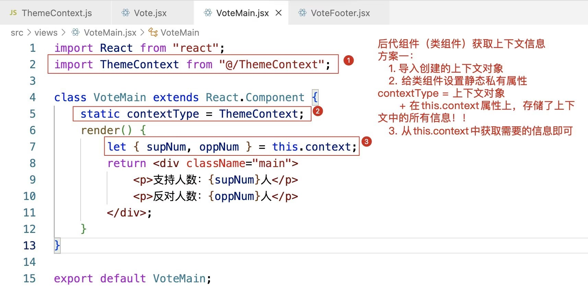

# React复合组件通信方案

大前端时代下，项目开发中，基本都采用 “工程化” + “组件化”！

### 工程化

基于gulp、webpack、vite、rollup等，实现代码转换、文件优化、代码分割、模块合并、自动刷新、代码校验、自动发布等！

### 组件化

普通业务组件：SPA单页面应用、业务拆分等
通用业务组件：具备复用性的业务模块
通用功能组件：UI组件库中的组件
……

而组件化开发中，必然会涉及 “父子组件、祖先和后代组件、平行组件、兄弟组件” 等，这就是所谓的 “复合组件”！我们今天要研究的话题就是：复合组件之间的通信(或数据传输)问题！！

## 1. 基于props属性，实现父子(或兄弟)组件间的通信





### 1.1父子组件通信：

1. 就是以父组件为主导，基于“属性”实现通信
原因：只有父组件可以调用子组件，此时才可以基于属性，把信息传递给子组件

+ 父组件基于属性，可以把信息传递给子组件 「父->子」
+ 父组件基于属性「插槽」，可以把HTML结构传递给子组件「父->子」
+ 父组件把方法基于属性传递给子组件，子组件把传递的方法执行 「子->父」
  
2. 父组件基于ref获取子组件实例「或者子组件基于useImperativeHandle暴露的数据和方法」
=============
我们调用Antd中的组件，就是经典的父子组件通信！！

#### 组件渲染的顺序：依赖于深度优先原则

1. 父组件第一次渲染：
   + 父 willMount -> 父render 「子 willMount -> 子render -> 子didMount」-> 父didMount
2. 父组件更新：
   + 父 shouldUpdate -> 父willUpdate -> 父render 「子willReciveProps -> 子shouldUpdate -> 子willUpdate -> 子render -> 子didUpdate」-> 父 didUpdate
  特殊：我们完全可以在子组件内部做优化处理，验证传递的属性值有没有变化，如果没有变化，则禁止更新
3. 父组件释放：
   + 父 willUnmount -> 父释放中「子willUnMount->子释放」-> 父释放


#### 单向数据流

##### 理解一：属性的传递方向是单向的

+ 父组件可基于属性把信息传给子组件
+ 子组件无法基于属性给父组件传信息；但可以把父组件传递的方法执行，从而实现子改父！

##### 理解二：关于生命周期函数的延续

+ 组件第一次渲染
  + 父 willMount -> 父 render
  + 子 willMount -> 子 render -> 子 didMount
  + 父 didMount

+ 组件更新
  + 父 shouldUpdate -> 父 willUpdate -> 父 render
  + 子 willReciveProps -> 子 shouldUpdate -> 子 willUpdate -> 子 render -> 子 didUpdate
  + 父 didUpdate

#### 函数组件



## 2. 基于context上下文，实现祖先/后代(或平行)组件间的通信

### 基于类组件实现



### 第一步：创建一个上下文对象，用来管理上下文中的信息

`ThemeContext.js`

```js
// 创建上下文对象
import { createContext } from 'react';
const ThemeContext = createContext();
export default ThemeContext;
```

#### 第二步：让祖先组件Vote，具备状态和修改状态的方法，同时还需要把这些信息，存储到上下文中！！！

`类组件 Vote.jsx`

```js
import React from 'react';
...
import ThemeContext from '@/ThemeContext';// 导入我们创建的上下文对象
class Vote extends React.Component {
  // 设置初始状态
  state = {
      supNum: 10,
      oppNum: 5
  };
  // 修改状态的方法
  change = type => {
      let { supNum, oppNum } = this.state;
      if (type === 'sup') {
          this.setState({ supNum: supNum + 1 });
          return;
      }
      this.setState({ oppNum: oppNum + 1 });
  };
  render() {
      let { supNum, oppNum } = this.state;
      return <ThemeContext.Provider
          value={{
              supNum,
              oppNum,
              change: this.change
          }}>
          <div className="vote-box">
              <header className="header">
                  <h2 className="title">React真的很不错!!</h2>
                  <span className="num">{supNum + oppNum}人</span>
              </header>
              <VoteMain />
              <VoteFooter />
          </div>
      </ThemeContext.Provider>;
  }
};
export default Vote;
```

基于上下文对象中，提供的Provider组件,用来︰

+ 向上下文中存储信息:value属性指定的值就是要存储的信息
+ 当祖先组件更新，render重新执行，会把最新的状态值，再次存储到上下文对象中!!

#### 第三步：在后代组件中，我们需要获取上下文中的信息

+ VoteMain：获取信息绑定即可
+ VoteFooter：获取信息，把获取的函数（修改组件组件状态的函数），再点击支持/反对的时候执行！！


`VoteMain.jsx`


```js
import React from 'react';
import ThemeContext from '@/ThemeContext';
class VoteMain extends React.Component {
  // 获取上下文信息
  static contextType = ThemeContext;
  render() {
      let { supNum, oppNum } = this.context;
      let total = supNum + oppNum,
          ratio = '--';
      if (total > 0) ratio = (supNum / total * 100).toFixed(2) + '%';
      return <div className="main">
          <p>支持人数：{supNum}人</p>
          <p>反对人数：{oppNum}人</p>
          <p>支持比率：{ratio}</p>
      </div>;
  }
};
export default VoteMain;
```
 `VoteFooter.jsx`

 

 ```js
 import React from 'react';
import ThemeContext from '@/ThemeContext';
class VoteFooter extends React.Component {
  render() {
      return <ThemeContext.Consumer>
          {context => {
              let { change } = context;
              return <div className="footer">
                  <button onClick={change.bind(null, 'sup')}>
                      支持
                  </button>
                  <button onClick={change.bind(null, 'opp')}>
                      反对
                  </button>
              </div>;
          }}
      </ThemeContext.Consumer>;
  }
};
export default VoteFooter;
 ```

 ### 基于函数组件

 函数组件存储到上下文和类组件是一样的

 在后代组件中，我们需要获取上下文中的信息

 方案一：
 ```js
 return <ThemeContext.Consumer>
  {context => {
  let { supNum,oppNum } = context;return <div className="main">
    <p>支持人数: {supNum}人</p>
    <p>反对人数: {oppNum}人</p>
  </ div>;
  }
</ThemeContext.Consumer>;

 ```

 方案二：

 ```js
 import React, { useContext } from 'react';
import ThemeContext from '@/ThemeContext';
const VoteFooter = function VoteFooter() {
    let { change } = useContext(ThemeContext);
    return <div className="footer">
        <button onClick={change.bind(null, 'sup')}>支持</button>
        <button onClick={change.bind(null, 'opp')}>反对</button>
    </div>;
};
export default VoteFooter;
 ```

 在真实项目中

+ 父子通信（或具备相同父亲的兄弟组件）：我们一般都是基于props属性实现
+ 其他组件之间的通信：我们都是基于 redux / react-redux 或者 mobx 去实现