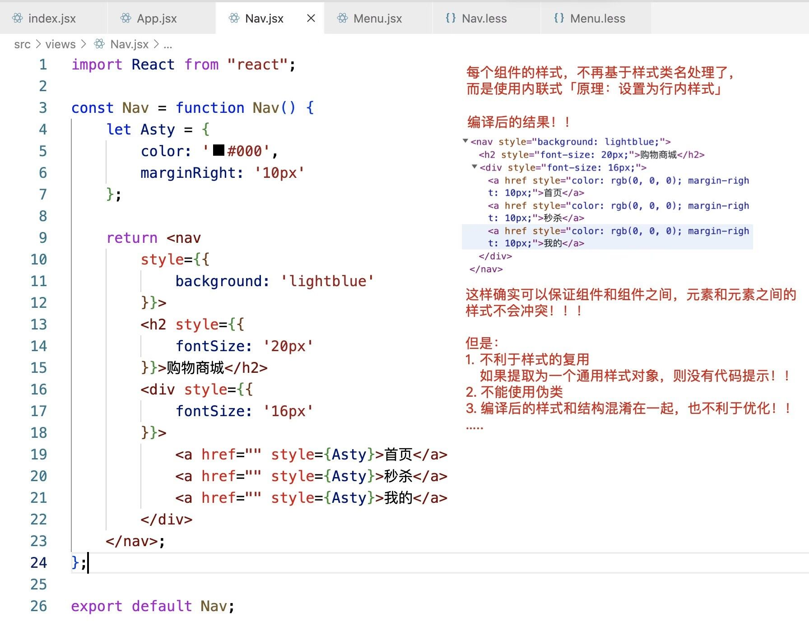

# React样式的处理方案

在vue开发中，我们可以基于scoped为组件设置样式私有化！

```less
<style lang="less" scoped>
.banner-box {
  box-sizing: border-box;
  height: 375px;
  background: #eee;
  overflow: hidden;
}
:deep(.van-swipe__indicators) {
    left: auto;
    right: 20px;
    transform: none;
}
</style>
```

但是react项目中并没有类似于这样的机制！如果我们想保证“团队协作开发”中，各组件间的样式不冲突，我们则需要基于特定的方案进行处理！

## 1、内联样式

在组件化开发的项目中，最后我们要把所有组件合并在一起进行渲染「SPA单页面应用」

这样就会存在一个问题：各组件之间的样式，可能会冲突

所以：如何保持各组件之间的样式不冲突「样式私有化」，则是组件化开发中，必须要考虑的事情



### 内联样式的优点：

+ **使用简单**： 简单的以组件为中心来实现样式的添加
+ **扩展方便**： 通过使用对象进行样式设置，可以方便的扩展对象来扩展样式
+ **避免冲突**： 最终都编译为元素的行内样式，不存在样式冲突的问题

在大型项目中，内联样式可能并不是一个很好的选择，因为内联样式还是有局限性的：

+ **不能使用伪类**： 这意味着 :hover、:focus、:actived、:visited 等都将无法使用
+ **不能使用媒体查询**： 媒体查询相关的属性不能使用
+ **减低代码可读性**： 如果使用很多的样式，代码的可读性将大大降低
+ **没有代码提示**： 当使用对象来定义样式时，是没有代码提示的

## 2. 使用CSS样式表

这种方式绝对不能成为项目中的主流处理方式！！！
但是偶尔有一些需求，我们可以基于这种方式处理！！

例如：

1. 样式是基于程序动态计算出来的，我们可以基于 style 方式，动态设置样式！！
2. 偶尔有一些标签，需要设置一个权重较高特殊样式，可以基于style的方式「原理：行内样式的优先级会高一些」

第二种：样式处理的技巧
基于样式表、样式类名这样的方式，但是需要 人为有意识的、有规范的 规避样式冲突问题

+ 首先保证每个组件最外层样式类名是不不冲突的
   命名方案：路径+组件名 作为组件外层容器的名字！！！
|- views
   |- perosn
      |- TableList.jsx         .person-table-list-box{}
      |- ControlTap.jsx      .person-control-tap-box{}
      |- ….
  |- product
      |- TableList.jsx         .product-table-list-box{}
      |- ….

+ 后期组件内部的元素，其样式，都基于less/sass/stylus嵌入到指定外层容器的样式类名之下去编写！！
    .person-table-list-box{
        a{….}
    }
    .product-table-list-box{
        a{….}
     }

CSS样式表应该是我们最常用的定义样式的方式！但多人协作开发中，很容易导致组件间的样式类名冲突，从而导致样式冲突；所以此时需要我们 人为有意识的 避免冲突！

+ 保证组件最外层样式类名的唯一性，例如：路径名称 + 组件名称 作为样式类名

+ 基于 less、sass、stylus 等css预编译语言的嵌套功能，保证组件后代元素的样式，都嵌入在外层样式类中！！

### CSS样式表的优点：

+ **结构样式分离**： 实现了样式和JavaScript的分离
+ **使用CSS所有功能**： 此方法允许我们使用CSS的任何语法，包括伪类、媒体查询等
+ **使用缓存**： 可对样式文件进行强缓存或协商缓存
+ **易编写**：CSS样式表在书写时会有代码提示

当然，CSS样式表也是有缺点的：

+ **产生冲突**： CSS选择器都具有相同的全局作用域，很容易造成样式冲突
+ **性能低**： 预编译语言的嵌套，可能带来的就是超长的选择器前缀，性能低！
+ **没有真正的动态样式**： 在CSS表中难以实现动态设置样式

## 3. CSS Modules

CSS的规则都是全局的，任何一个组件的样式规则，都对整个页面有效；产生局部作用域的唯一方法，就是使用一个独一无二的class名字；这就是 CSS Modules 的做法！

1. 我们的样式都写在 xxx.module.css 文件中
   这样的文件是CSS文件，不能在使用less/sass/stylus这样的预编译语言了！！

2. 我们在组件中，基于ES6Module模块规范导入进来
  import sty from '.xxx.module.css'
  sty存储的是一个对象
  对象中包含多组键值对：
    + 键：我们之前才css中编写的样式类名   .box{} 
    + 值：经过webpack编译后的样式类名  .Nav_box__c6EW3{}

3. 我们编写的CSS样式也会被编译，所有之前的样式，也都编译为混淆后的类名了「和上述对象中编译后的值一样」

4. 我们在组件中，所有元素的样式类，基于 sty.xxx 去操作！！！

css Modules的原理:
把各个组件中，编写的样式「不经过处理之前，是全局都生效样式」进行私有化处理

+ 把所有样式类名，进行编译混淆，保证唯一性王

`全局作用域`
CSS Modules 允许使用 :global(.className) 的语法，声明一个全局规则。凡是这样声明的class，都不会被编译成哈希字符串。

`class继承/组合`
在 CSS Modules 中，一个选择器可以继承另一个选择器的规则，这称为”组合”

```css
// xxx.module.css
.title {
    color: red;
    font-size: 16px;
}
.subTitle {
    composes: title;
    font-size: 14px;
}

// 组件还是正常的调用，但是编译后的结果
<h1 class="demo_title__tN+WF">珠峰培训</h1>
<h2 class="demo_subTitle__rR4WF demo_title__tN+WF">珠峰培训</h2>

```

## 4. React-JSS

JSS是一个CSS创作工具，它允许我们使用JavaScript以生命式、无冲突和可重用的方式来描述样式。JSS 是一种新的样式策略！ ​React-JSS 是一个框架集成，可以在 React 应用程序中使用 JSS。它是一个单独的包，所以不需要安装 JSS 核心，只需要 React-JSS 包即可。React-JSS 使用新的 Hooks API 将 JSS 与 React 结合使用。

基于createUseStyles方法，构建组件需要的样式﹔返回结果是一个自定义Hook函数!

+ 对象中的每个成员就是创建的样式类名
+ 可以类似于less等预编译语言中的“嵌套语法”，给其后代/伪类等设置样式!!


自定义Hook执行，返回一个对象，对象中包含

+ 我们创建的样式类名，作为属性名
+ 编译后的样式类名「唯一的」，作为属性值

类组件中，不能直接使用ReactJSS，需要经过处理

## 5. styled-components

目前在React中，还流行 CSS-IN-JS 的模式：也就是把CSS像JS一样进行编写；其中比较常用的插件就是 styled-components！

```shell
$ yarn add styled-components
https://styled-components.com/docs/basics#getting-started
```

创建一个样式的js文件，例如：style.js
想要有语法提示，可以安装vscode插件：vscode-styled-components

基于“styled.标签名”这种方式编写需要的样式

+ 样式要写在“ES6模板字符串"中
+ 返回并且导出的结果是一个自定义组价
