# 合成事件

## 原生事件

### 事件和事件绑定

+ 事件是浏览器内置行为
+ 事件绑定是给事件行为绑定方法
  + 元素.onxxx=function…
  + 元素.addEventListener(‘xxx’,function(){},true/false)

### 事件的传播机制

+ 捕获 CAPTURING_PHASE
+ 目标 AT_TARGET
+ 冒泡 BUBBLING_PHASE

### 阻止冒泡传播

+ ev.cancelBubble=true 「<=IE8」
+ ev.stopPropagation()
+ ev.stopImmediatePropagation() 阻止监听同一事件的其他事件监听器被调用

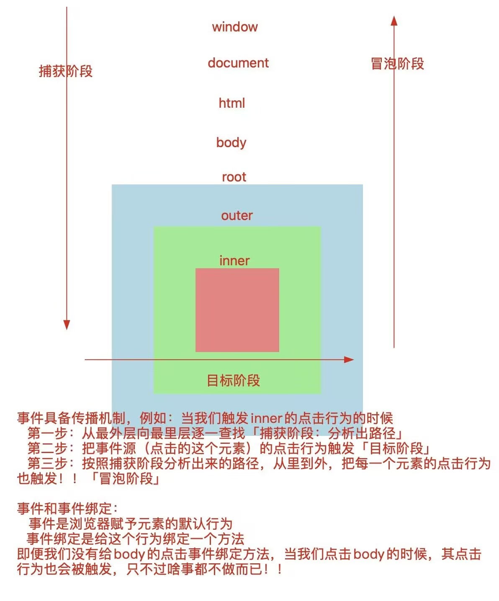
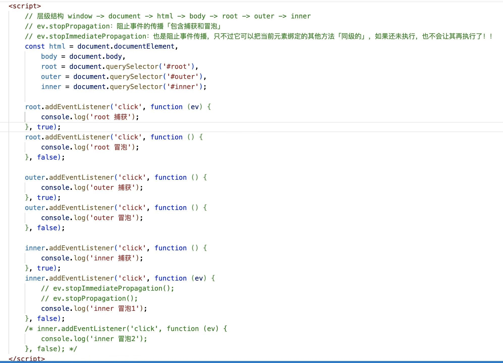

### 事件委托：利用事件的传播机制，实现的一套事件绑定处理方案 

例如：一个容器中，有很多元素都要在点击的时候做一些事情
  传统方案：首先获取需要操作的元素，然后逐一做事件绑定
  事件委托：只需要给容器做一个事件绑定「点击内部的任何元素，根据事件的冒泡传播机制，都会让容器的点击事件也触发；我们在这里，根据事件源，做不同的事情就可以了；」

#### 优势:

  + 提高JS代码运行的性能「减少内存消耗」，并且把处理的逻辑都集中在一起！！
  + 某些需求必须基于事件委托处理，例如：除了点击xxx外，点击其余的任何东西，都咋咋咋...
  + 给动态绑定的元素做事件绑定
  + ...
限制：
  + 当前操作的事件必须支持冒泡传播机制才可以
    例如：mouseenter/mouseleave等事件是没有冒泡传播机制的
  + 如果单独做的事件绑定中，做了事件传播机制的阻止，那么事件委托中的操作也不会生效！！

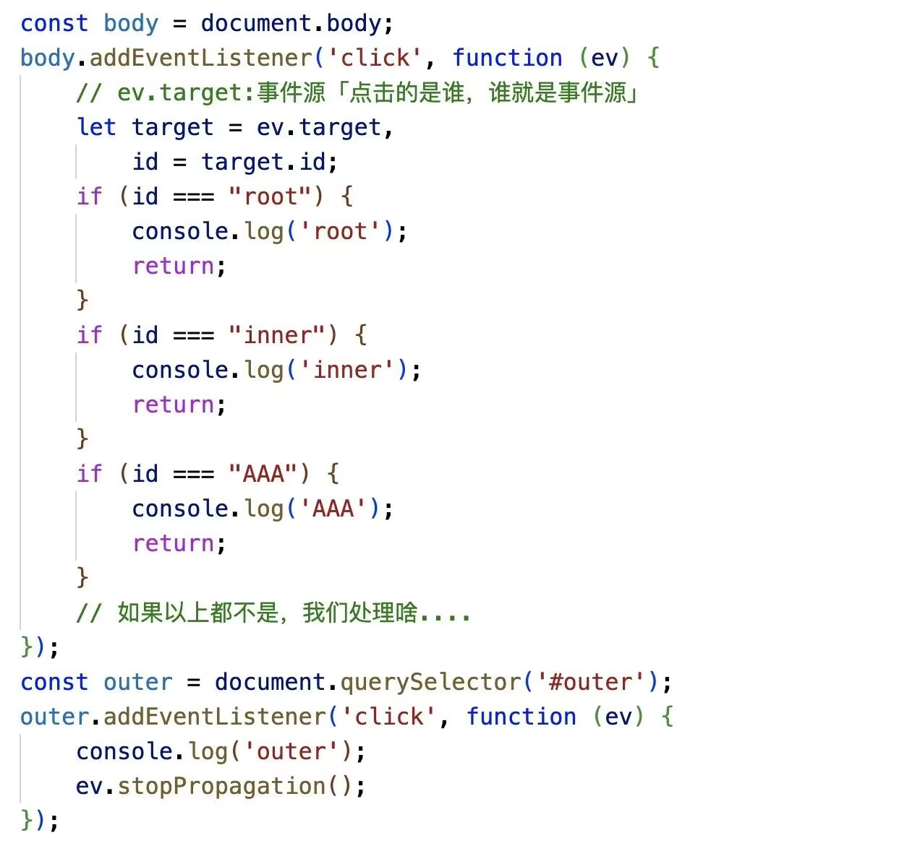

# React中合成事件的处理原理

“绝对不是”给当前元素基于addEventListener单独做的事件绑定，React中的合成事件，都是基于**事件委托**处理的！

  + 在React17及以后版本，都是委托给#root这个容器「捕获和冒泡都做了委托」；
  + 在17版本以前，都是为委托给document容器的「而且只做了冒泡阶段的委托」；
  + 对于没有实现事件传播机制的事件，才是单独做的事件绑定「例如：onMouseEnter/onMouseLeave...」

在组件渲染的时候，如果发现JSX元素属性中有 onXxx/onXxxCapture 这样的属性，不会给当前元素直接做事件绑定，只是把绑定的方法赋值给元素的相关属性！！例如：

  ```js
  outer.onClick=() => {console.log('outer 冒泡「合成」');}  //这不是DOM0级事件绑定「这样的才是 outer.onclick」
  outer.onClickCapture=() => {console.log('outer 捕获「合成」');}
  inner.onClick=() => {console.log('inner 冒泡「合成」');}
  inner.onClickCapture=() => {console.log('inner 捕获「合成」');}
  ```

然后对#root这个容器做了事件绑定「捕获和冒泡都做了」
  原因：因为组件中所渲染的内容，最后都会插入到#root容器中，这样点击页面中任何一个元素，最后都会把#root的点击行为触发！！
  而在给#root绑定的方法中，把之前给元素设置的onXxx/onXxxCapture属性，在相应的阶段执行!!

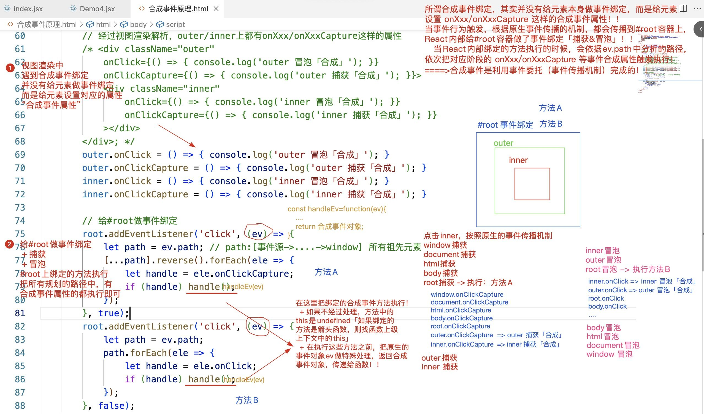

基于React内部的处理，如果我们给合成事件绑定一个“普通函数”，当事件行为触发，绑定的函数执行；方法中的this会是undefined「不好」！！ 解决方案：this->实例
  + 我们可以基于JS中的bind方法：预先处理函数中的this和实参的
  + 推荐：当然也可以把绑定的函数设置为“箭头函数”，让其使用上下文中的this「也就是我们的实例」

 bind在React事件绑定的中运用
+ 绑定的方法是一个普通函数，需要改变函数中的this是实例，此时需要用到bind「一般都是绑定箭头函数」
+ 想给函数传递指定的实参，可以基于bind预先处理「bind会把事件对象以最后一个实参传递给函数」 
  
合成事件对象SyntheticBaseEvent：我们在React合成事件触发的时候，也可以获取到事件对象，只不过此对象是合成事件对象「React内部经过特殊处理，把各个浏览器的事件对象统一化后，构建的一个事件对象」
  合成事件对象中，也包含了浏览器内置事件对象中的一些属性和方法「常用的基本都有」
  + clientX/clientY
  + pageX/pageY
  + target
  + type
  + preventDefault
  + stopPropagation
  + ...
  + nativeEvent：基于这个属性，可以获取浏览器内置『原生』的事件对象
  + ...

```js
import React from "react";

class Demo extends React.Component {
    render() {
        return <div className="outer"
            onClick={() => {
                console.log('outer 冒泡「合成」');
            }}
            onClickCapture={() => {
                console.log('outer 捕获「合成」');
            }}>

            <div className="inner"
                onClick={() => {
                    console.log('inner 冒泡「合成」');
                }}
                onClickCapture={() => {
                    console.log('inner 捕获「合成」');
                }}
            ></div>

        </div>;
    }

    componentDidMount() {
        document.addEventListener('click', () => {
            console.log('document 捕获');
        }, true);
        document.addEventListener('click', () => {
            console.log('document 冒泡');
        }, false);

        document.body.addEventListener('click', () => {
            console.log('body 捕获');
        }, true);
        document.body.addEventListener('click', () => {
            console.log('body 冒泡');
        }, false);

        let root = document.querySelector('#root');
        root.addEventListener('click', () => {
            console.log('root 捕获');
        }, true);
        root.addEventListener('click', () => {
            console.log('root 冒泡');
        }, false);

        let outer = document.querySelector('.outer');
        outer.addEventListener('click', () => {
            console.log('outer 捕获「原生」');
        }, true);
        outer.addEventListener('click', () => {
            console.log('outer 冒泡「原生」');
        }, false);

        let inner = document.querySelector('.inner');
        inner.addEventListener('click', () => {
            console.log('inner 捕获「原生」');
        }, true);
        inner.addEventListener('click', () => {
            console.log('inner 冒泡「原生」');
        }, false);
    }
}

export default Demo;
```

图解执行步骤
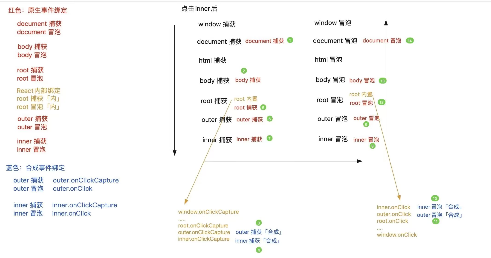

### React16

##### React16合成对象原理

###### React16中合成事件的处理原理

> 在16版本中，合成事件的处理机制，不再是把事件委托给#root元素，而是委托给document元素，并且只做了冒泡阶段的委托；在委托的方法中，把onXxx/onXxxCapture合成事件属性进行执行！！

React16中，关于合成事件对象的处理，React内部是基于“事件对象池”，做了一个缓存机制！！React17及以后，是去掉了这套事件对象池和缓存机制的！！
  + 当每一次事件触发的时候，如果传播到了委托的元素上「document/#root」，在委托的方法中，我们首先会对内置事件对象做统一处理，生成合成事件对象！！
在React16版本中：为了防止每一次都是重新创建出新的合成事件对象，它设置了一个事件对象池「缓存池」
 + 本次事件触发，获取到事件操作的相关信息后，我们从 事件对象池 中获取存储的合成事件对象，把信息赋值给相关的成员！
 + 等待本次操作结束，把合成事件对象中的成员信息都清空掉，再放入到 事件对象池 中！！
 + 缓存和共享：对于那些被频繁使用的对象，在使用完后，不立即将它们释放，而是将它们缓存起来，以供后续的应用程序重复使用，从而减少创建对象和释放对象的次数，进而改善应用程序的性能！
  + 使用完成之后，释放对象「每一项内容都清空」，缓存进去！
+ 调用 event.persist() 可以保留住这些值！


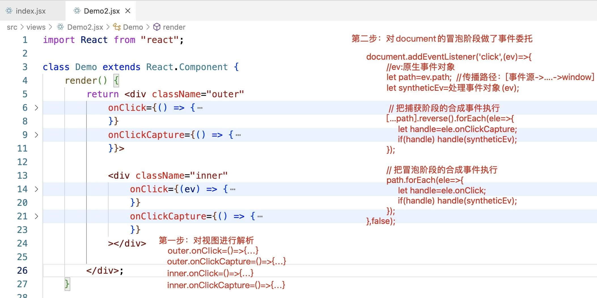
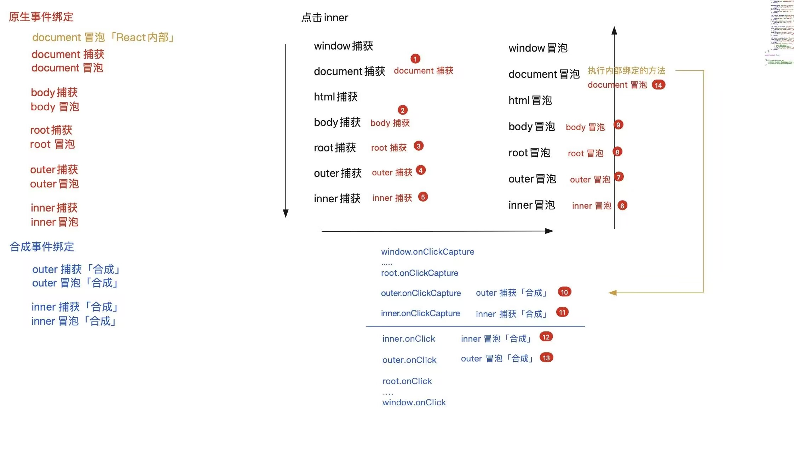

##### React对象事件池

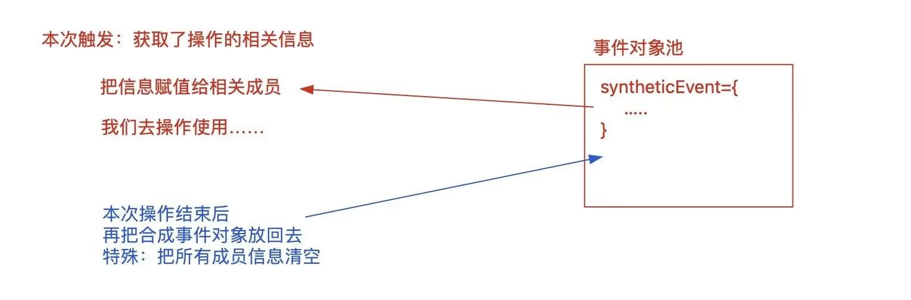


1. 移动端的click会存在300ms延迟
2. 移动端的click是单击事件
3. PC端的click是点击
4. 连着点击两下：
   + PC端会触发：两次click、一次dblclick
   + 移动端：不会触发click，只会触发dblclick

>单击事件：第一次点击后，监测300ms，看是否有第二次点击操作，如果没有就是单击，如果有就是双击
单手指事件模型：touch
touchstart
touchmove
touchend

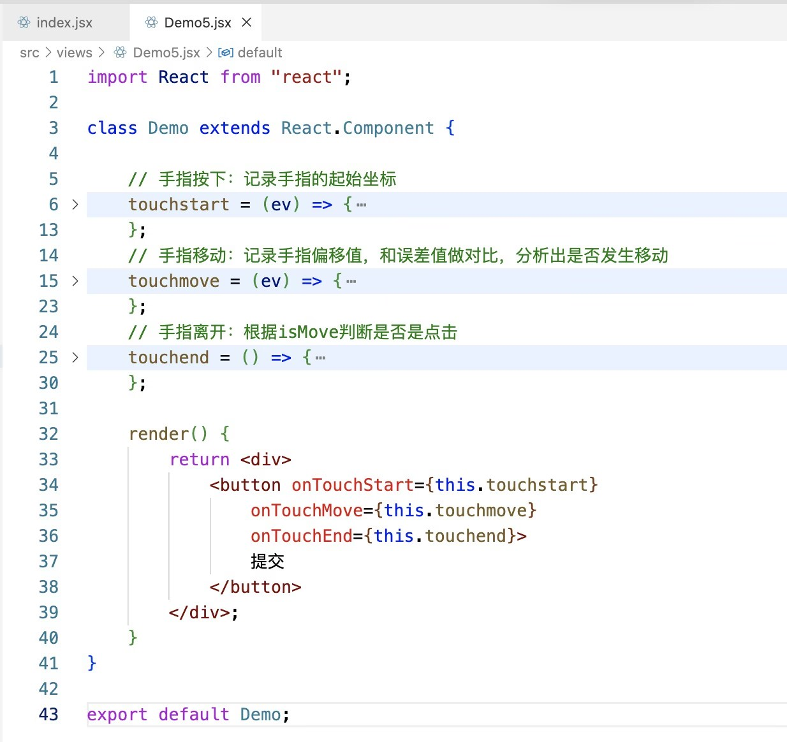
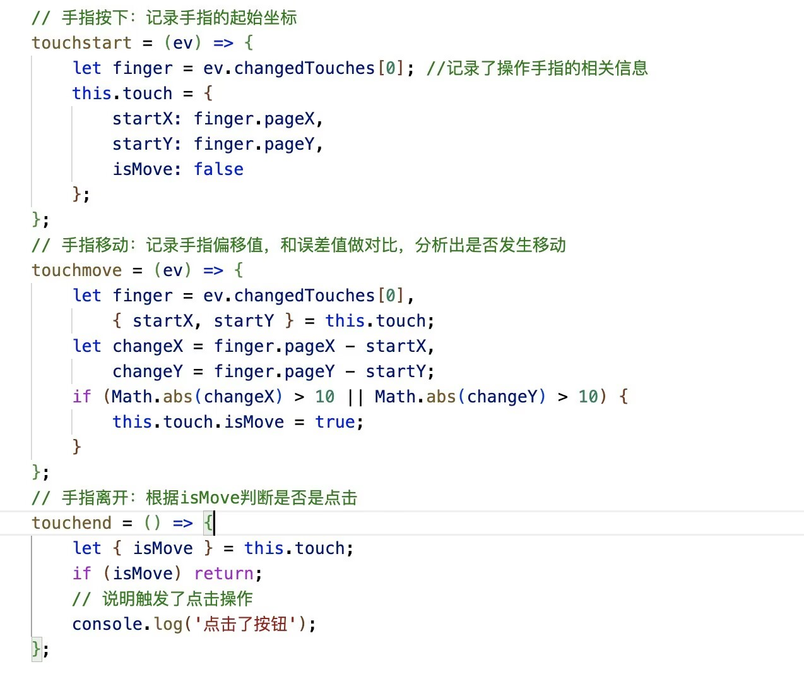
**解决300ms延迟**
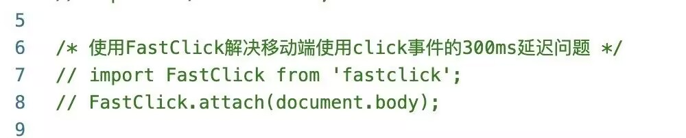

在React中，我们给循环「创建」的元素做“循环事件绑定”，好还是不好？

按照常理来讲，此类需求用事件委托处理是组好的！！！

在React中，我们循环给元素绑定的合成事件，本身就是基于事件委托处理的！！所以无需我们自己再单独的设置事件委托的处理机制！！！
